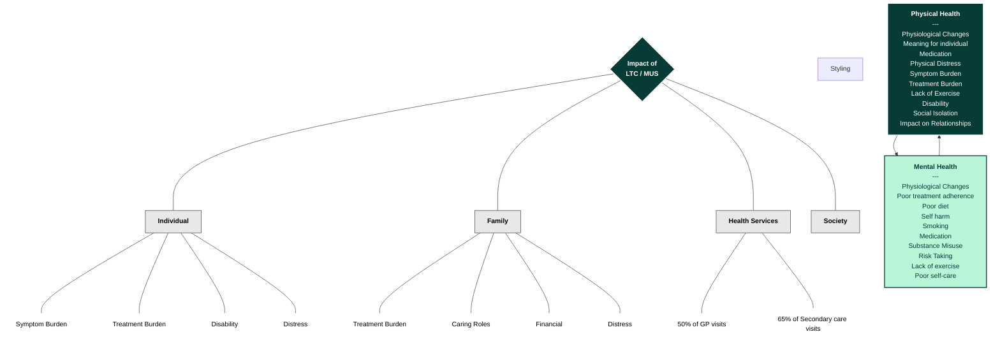
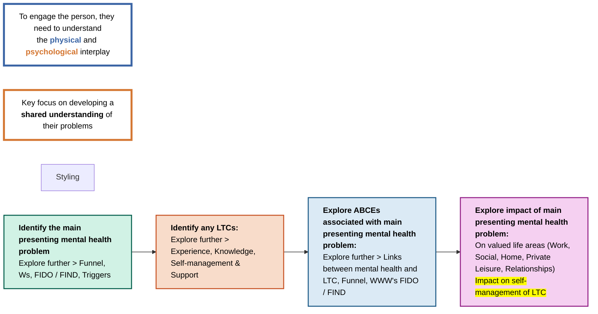
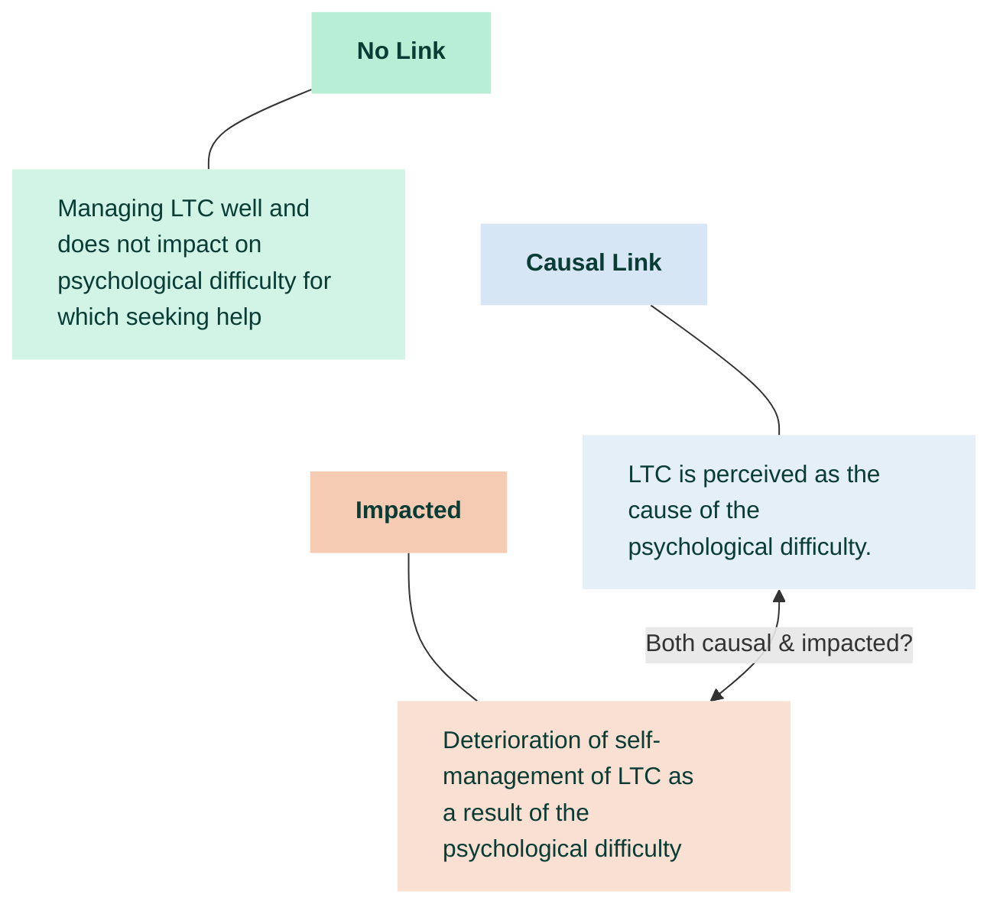

# Agenda 

### **Afternoon: Practice & Application**
- **12:45 – 13:30:** Lunch.
- **13:30 – 15:00:** **Management of CMHPs.** Addressing barriers to access and evidence-based guidelines for multiple health conditions.
- **15:00 – 15:15:** Break.
- **15:15 – 16:15:** **Practitioner Adaptations.** Exploring assessment areas, patient self-management, and the CMHP-physical health relationship (including roleplay).
- **16:15 – 16:30:** Wrapping up and final questions.

# Todays Focus 
1. Background to CMHP in the context of LTCs 
2. Principles of Chronic Disease Management
3. Consider  enhancing and adapting practice to support patients with LTCs 

## Practice Based Logbook
1. Personal Details and Declaration - This is completed and signed by me and supervisor 
2. Patient Contact and Supervision Log - Detailing clinical work with patients 
3. Reflective Statement - Focused on my use of collaborative care to support patients detailed in the above log 
4. Supervisor statement of competence signed by supervisor doing Case Management Supervision for your clinical work with patients with LTC/MUS to ‘sign off’ competence working with patients with LTC/MUS.

Examples
![[Pasted image 20260223102546.png]]
![[Pasted image 20260223102607.png]]
### Minimal Clinical Requirements 
- 1 Completed Assessment session with at lead two different patients 
- 4 Completed treatment sessions with at least 2 different patients 
- A total of at least 6hrs of clinical contact time across patient cases recorded in the log. 
- CMS received for each patient recorded in log
- All clinical hours must take place after day 1 of testing. 

### Reflective Log

I generally feel comfortable discussing and exploring LTCs and how they may be impacting and mixed with the persons mental health. However, I feel this is largely limited to assessments and trying to formulate an understanding with them around it. 

I feel when it comes to treatments specifically, I feel it can be best summarised as consciously incompetent, in that although I can work with the patient to best and come to a confident shared understanding, I can feel there can be a gap sometimes in how best to approach it - typically if things do fall outside the typically S2 presentation/approach. 

In this sense, I hope for two things from this training: 
- If my current approach and understanding is in-line with practice and "in the right direction"
- To learn new approaches/adaptations to treatments to fill current gap in knowledge and improve confidence in practice. 

# Background to Common Mental Health Problems in the Context of Long - Term Conditions

## Glossary 
- **Long-term Condition (LTC)**: A health problem that cannot be cured but can be controlled by medication or other therapies.
- **Co-morbidity**: Conditions that exist at the time of diagnosis of an index disease or later, but that are not a consequence of an index disease.
- **Multi-morbidity**: The existence of two or more chronic diseases. Issues associated with this include 'polypharmacy'.
- **Medically Unexplained Symptoms (MUS)**: Physical complaints which cannot currently be understood or explained in terms of underlying organic pathology. These can include a range of symptoms like pain, fatigue, or dizziness, which may occur one at a time or simultaneously. Common syndromes under this umbrella include Chronic Fatigue Syndrome, Irritable Bowel Syndrome, and Fibromyalgia.
- **Bio-Psycho-Social Perspective**: An approach to understanding health that considers the interconnected impact of biological, psychological, and social factors.

### LTC's 
There is no definitive list of LTCs and can include diabetes, asthma, coronary heart disease, COPD, cancer and HIV or even CMHP. 
- Around 2/3 of those over 60 have LTC

### MUS 
- Can include a range of symptoms including pain, fatigue or dizziness. 
- May experience a single or multiple symptoms and can occur single or multiple at a time.
- Where possible, a specioifc diagonis of a synfrome which describes core symptoms should be used i.e 
	- CFS
	- IBS
	- Fibro
- General symptoms apply to both LTC and MUS

## Illness Burden 

They may have:
- Poorer clinical outcomes and lower quality of life
- £8-13bn of NHS spending linked to impact of CMHP on LTCs

Example: Mortality rates after a heart attack or heart surgery are several times higher for those with depression. (Lesperance et al., 2002; Junger et al., 2005)

## Impact of MH vs LTC on a persons life 
The presence of MH problems can have a greater effect on function and QoL than the severity of the LTC. 
- COPD - depression and/or anxiety can impact more on functional status than COPD severity, and are more closely correlated with poorer QoL than lung function (Yohannes et al., 2010)
- Cardiovascular diseases - depressive symptoms have a greater impact on QoL than the severity of cardiac problems (de Jonge et al., 2006)

> [!tldr]+ TLDR
> Often the presence of CMHP can lead to worse QOL and function that is disproportionately greter than the severity of the LTC alone. I.E the belief in it worsens the severity. 

## Healthcare inequities 

**Gender inequities**
Cardiovascular disease 
- Women less likely to be diagnosed promptly. 
- Symptoms in women can differ from men and are often missed or misinterpreted (Bosomworth & Khan, 2023)

Pain 
- Women's pain is more likely to be dismissed as emotional, exaggerated or psychological (Guzikevits et al., 2024)
- **Prescription Bias:** Women are more likely to be prescribed **sedatives or antidepressants** rather than pain relief when compared to men presenting with similar symptoms (Stieger et al., 2025).
    

---

**Racial Inequities**
- **Access & Communication:** Bangladeshi, Pakistani, and Black communities report:
    - Greater difficulty securing GP appointments.
    - Poorer communication with GPs.
    - Lower overall satisfaction with care (NHS Race & Health Observatory, 2025).
        
**Cardiovascular Disease (CVD)**
**Treatment Gaps:** Black and Mixed ethnic patients are less likely than other groups to:
- Be prescribed drug therapy.
- Receive regular monitoring.
- Reach target treatment thresholds, such as blood pressure targets (NHS Race & Health Observatory, 2025).

---
 **LGBTQ+ Inequities**
- **Physical Activity:** **55%** of gay, bisexual, and trans men are not active enough to maintain good health, compared to **33%** of men in the general population (LGBT Foundation, 2020).
- **Cancer Care:** LGB individuals with cancer are less likely than heterosexual patients to believe hospital staff "always did everything they could" to manage their pain (LGBT Foundation, 2020).

## Intersectionality
- **Double Burden** of different factors such as women of colour can experience poorer pain management or being dismissed. (Hood, 2025)
- Screening **rates were lower in women from BAME groups** (The Kings Fund, 2025)
- Past experiences shape perception and engagement e.g Older LGBTQ+ people. (LGBT Foundation 2020)
- **Socioeconomic status** - People with both LTCs and CMHP live disproportionately in deprived areas and have access to fewer resources. (The Kings Fund, 2012)
	- Is this correlation or causation - or a mixture of both. Could it be a negative spiral for these areas? 

# Health from a Bio-Psycho-Social Perspective

What do I bring? 

- Our own intersections/identity may impact on our work as PWPs and vice versa 
- Everyone holds views/values (unconscious or conscious); these can influence our practice. 
- Healthcare professionals show same levels of implicit bias as wider population. These biases may influence diagnosis and treatment (FitzGerald & Hurst, 2017). 
- Clinicians may reduce effects of biases by self-educating about biases, reflection, supervision and feedback (Yager, Kay, & Kelsay, 2021).

# Management of Mental Health Problems in the Context of Long-Term Conditions
We know that we can't ignore one or the either but often treating LTC within MH has not always been the best. Today we will be thinking about what we as PWPs can do within the guidence to effectively treat CMHP with LTCs. 

## Evidence base for treating MH in the context of LTCs 
- Evidence that psychological interventions are effective but effect sizes are small-moderate (Farrand & Woodford, 2015) 
- Real-world NHS TT data showed large, clinically meaningful reductions in depression (PHQ-9) and anxiety (GAD-7) for patients with and without LTCs (Lee et al, 2024) 
	- Improvements in functioning amongst LTC patients, highlighting the benefit of psychological interventions for improving the impact LTCs can have on quality of life, functioning, and wellbeing.

## Barriers to Care
- [?] People with LTCs are less likely to receive appropriate mental healthcare? Why?

- Practitioner awareness or belief: Assumption that it is only in the domain of physical health - it is the LTCs causing it so how would CMHP fix it. Its physical health and so GP and vice versa becomes a circle or revolving door. 
- Non-adjusted or adapted support may emphasise difficulty - belief they are not the right fit vs the other way around - not treatable. 
- Dislike of having to share or repeat difficulties 
- Patient understanding of how CMHP and support can interact - Often referred to services but not told or unsure as to why they were referred in or how service can help. 
	- What is working on my CMHP going to do to improve my symptoms. 
	- Motivation to change or belief of change - It won't let me do what I can't do anymore 
	- Goals going into treatment can be informed by this. 

### Problems at multiple levels 
There have been difficulties linked to: 
- Identification
- Acceptance 
- Terminology 
- Confidence in mental treatment (See above)
- Patient engagement (See above)

## NICE Guidelines Delivering an approach to care that takes into account multimorbidity - NICE 2016
- Involves personalised assessment and development of an individualised management plan.
	- This includes the medicines they are taking and services they are attending. 
- Aims to improve QOL by reducing treatment burden, adverse events and unplanned or uncoordinated care. 
- Take account of a persons needs preferences and priorities. 
- Improve coordination of care across services if it has been fragmented. 

####  Establish the disease burden by talking to people about how their health problems affect their day-to-day life. This includes:
- Mental health
- How disease effects their wellbeing 
- How their health problems interact and how this impacts QOL 

#### Establish Treatment Burden by talking to patient about how treatments for health problems affect their day-to-day life. Include in the discussion: 
- Number of appointments they have and where?
- Number of medicines they are taking and how often?
- Any harms of medication?
- Non-pharmacological treatments such as diets or exercise or MH support. 
- Effects of treatment on their wellbeing

#### Be alert to: 
- Depression and anxiety
- Chronic Pain 

#### Encourage to clarify what is important to them, including their personal goals, values and priorities.
- Maintain independence 
- Paid or voluntary work 
- Taking part in social activity or playing an active role in family life
- Preventing specific adverse outcomes 
- Reducing harms from medicines 
- Reducing treatment burden 
- Lengthening life 

Guiding principles to support decision-making in primary care consultations. 
Sharing of realistic treatment goals: 
1. Thorough interaction assessment of patient's conditions, treatments, constitution, and context. 
2. Prioritisation of health problems that take into account the patient's preferences and desired outcomes 
3. Individualised management

### How does this reach their everyday?
- Where treatment burden is felt → daily routines 
- Where multimorbidity creates conflicts → behaviour choices 
- Where personalised care is negotiated → self-management 
- Where **PWPs can make** the biggest difference → **supporting lifestyle-related behaviour**

| NICE multimorbidity principle | Where it shows up daily                    |
| ----------------------------- | ------------------------------------------ |
| Treatment Burden              | medication routines, appointments, fatigue |
| Personalised Priorities       | Health Behaviours and Patient Values       |
| Coordination of care          | Managing Multiple Reccomendations          |
| QoL                           | Activity levels, diet, sleep               |

## Lifestyle factors 
Self-management is central to living well with LTCs

##### Mental Health problems
- Can reduced self-management ability - e.g less likely to take medications as prescribed 
- Can increase adverse health behaviours - substance misuse

##### Cardiac Disease 
- Depression impairs ability to engage with self-management such as stopping smoking, diet or following rehabilitation programmes  
##### Diabetes 
- Mental health is associated with poorer dietary control and adherence to medication 

- [c] Treating mental health in the context of physically ill health will not always result in improved physical symptoms. (Cimpean & Drake, 2011)
- [p] Integrating treatment for mental and physical health is more effective (Wroe et al., 2015)

How can this impact PWP practice
- Focusing on adherence to areas looking at physical health i.e rather than just looking at mood if they are neglecting self-care etc this is likely to have a greater impact to mood than just looking at mood on its own. ==Links directly to goals and focus==

## Behaviour Change
Change is difficult and often still a focus in normative psychological therapy. 

##### What do we already have?
- COMB
- SMART Goals 
- Problem Solving
- BA + Goal Setting
- Motivational Interviewing 

> [!tldr]+ TLDR
> - Multiple barriers can exist to accessing, accepting and engaging with mental healthcare for those with LTCs •Specific guidelines for working with those with multimorbidity 
> - Patient-centredness (PWP bread and butter!) •Self-Management integral to living well with most LTCS 
> - Where possible, PWPs need to support self-management of LTCs in order to promote sustained recovery from Common Mental Health Problems (Some of same tools we already use can help with this!)

# PWP Assessment when working with patients with LTCs / MUS (Information Gathering: Problem-Focused Assessment)

- Consider practical adaptations to make before the assessment session  
- Adapt assessment structure while maintaining fidelity
- Explore the interaction between MH and LTC factors 
 - Identify when to return focus to the MH problem •Reflect on how your beliefs may interact with our patient 

## Before assessment 
Before going into assessment, consider:
- What do we know already?
	- Are there any reasonable adjustments that we could make going in.
- Are there any physical adaptations required?
	- Access to rooms, disabled parking, chairs, lighting.
- Do we need to adjust the length of the session
	- Fatigue or pain may affect how long or short they need or can sit/focus in session. 
- Do they need carer present to support them? 

The assessment itself remains largely the same, **HOWEVER**, we try to emphasise the role of collaborative care with other involved professionals. 
- PWPs are best place to support and manage CMHPs in people with LTCs but may have limited disorder specific knowledge. 
- Helpful to have a broad awareness and knowledge of LTCs are what they can look like. 
- You are not expected to be a medical expert. 

## Promote Engagement 

- Patients with LTCs often have a long history of medical encounters and cna be often frustrating and challenging when having to go over them time and time. 
- Frequently told to "just live with it"
	- Not only it but the impact and stigma of it
- A shift towards living better with the conditions and improving QoL and instilling hope.  

### Important to note
- Focusing on the mental health problem first - if the patient focuses directly on LTCs we can suggest making note of it to come back to MHP is.

**Identify and explore the LTCs**
- Can you tell me about your ==experience== of living with an LTCs?
- I know a little about it could you tell me about your ==understanding==?
- Have you had any support around ==managing== your LTC?
	- Tell me about the advice you've been given
- ==What do you do to manage it? How is it going?==

### Reflective log
What has my experience of health and ill health been like? (This could be about own health, health of others around us, messages we’ve been exposed to elsewhere) 
- My experience has been fairly neutral - I myself live with a long-term condition although this is fairly mild in its impact. I find that this had reduced the hesitation to discuss it with a patient. If often try to engage with the patient to get a better understanding past the LTC label - what does it actually look like for you? What impacts does this have?  

How have these experiences shaped my attitude towards, and beliefs about ill health? 
- How should people take care of their health? What personal responsibility do we have?
	- I do think as all things people have the personal responsibility to decide for themselves how they take care for themselves - I think it is important to support them to make the most informed understanding decision they can. This is often where I see the role of a PWP sitting. 

- Beliefs about specific LTCs? 
	- I try to keep an open neutral mind on it. 

- Beliefs about how specific LTCs should be managed? 
	- Again I often acknowledge that I often don't know enough to how it SHOULD be managed to hold a strong belief. 
- How might these beliefs impact on my practice as a PWP when working with patients with LTCs (or MUS)?
	- I do think any beliefs and experience can naturally creep in work with patients - I think this is why it's important to gain a person centred understanding first to best understand their experience and their goals.  

### Linking and finding the relationship to the LTC

**N.B:** The impact of mental health on physical health can overlap with symptoms of LTCs - although exploring if there things have worsened or intensified from usual presentation can reveal this. 

## Exploring impact on valued live areas
**Adaptation**: Explore whether there is a difference between how the physical and how the psychological difficulties impact.
- **Specifically explore**: Is the psychological difficulty impacting upon the self-management of the LTC? (this may have been discussed already

We may have to sit with discomfrot or fears in the face of complexity and uncertainty going forwards.

BUT

- Often things aren't as complex as we assume
- Aim for shared idiosyncratic understanding of presenting problems. 
- Focus on discovering key cognitive-behavioural factors maintaining MH problem (may be some overlap with maintaining factors in physical health presentation - i.e target the mechanism for change.