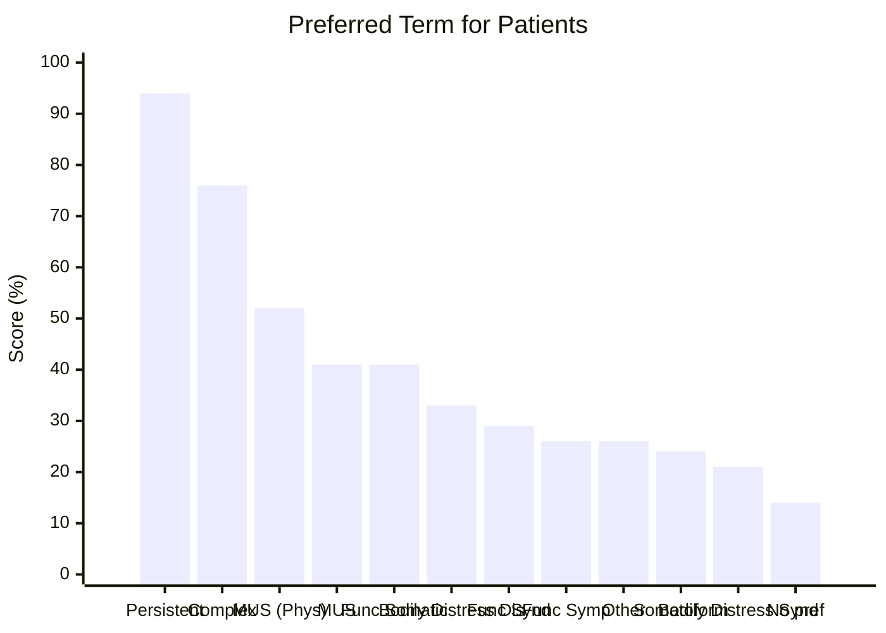
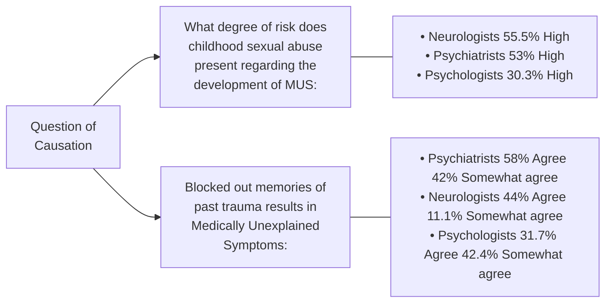
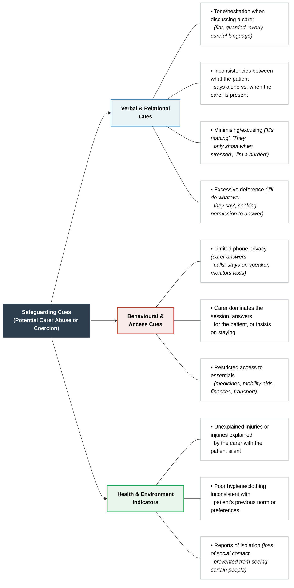

# Building Understanding of Common LTCs & Self-Management Guidance 
⚠️ We are not expected to be experts in all health conditions just have a good level of understanding.

# Diabetes
There are two types of these:
- Type 1
- Type 2

### Type 1 Diaebtes
This is an autoimmune disease as it destroys the cells in the pancreas that produces insulin. 
- Insulin regulates blood sugar by absorbing the glucose into the cells of the body where it is needed to regulate energy. 
- This excess glucose leads to removal via urine which leads to increased weeing. 
- Fat stores are broken down for energy which leads to a build up of ketones in the blood… 
	- Ketones cause the blood to become too acidic

![[Pasted image 20260224095948.png]]

#### Diabetic Ketoacidosis 
Symptoms: 
- Dehydration
- Tummy Pain
- Vomiting 
- Drowsiness
- Weight loss
- Fruity smelling breath
- Increased respiratory rate 
- Blurred vision

This can develop over a matter of hours and if it becomes severe can require hospitalisation. 
- This often is how it is identified. 

This is also why frequent blood sugar monitoring and adherence to insulin therapy are essential to avoid this. 

#### T1D Self-Management 
**Blood Glucose Monitoring**
- Regular testing to identify hyper or hypo-glycemia 
- Can be used to calculate the right dose of insulin 

**Carb-Counting & Diet Choices**
They will be required to calculate the carbs within their meals and portions as this will affect their blood sugar levels. (Most carbohydrates are broken down into sugars)
- Books/ apps available with precalculated carbs for different meals and portion sizes 
- Apps available to help calculate insulin needed to cover carbs for the individual person 
- Awareness of factors influencing speed of glucose absorption important (e.g. GI, balancing food groups)

**Insulin Medication**
- Pen Injections (Most Common) - Bolus and Basal types of insulin
- Insulin Pumps 
- Closed Loop Systems (These are regulated by an algorithm)

**Physical Activity**
- Exercise can improve the effectiveness of insulin to lower the BGL 
- Important to balance these three areas to prevent dips or spikes. 

### Hypoglycaemia (Low)

This is a complication of the insulin therapy and is the result of too much insulin for the levels of BGL. 

Contributing factors include: 
- Missing a meal or snack
- Not having enough carbs in the meal 
- Doing a lot of exercise without the extra carbs 
- Taking more insulin than required
- Drinking alcohol 
- Being unwell
- Being stressed or anxious 

> [!warning]+ 
> Hypos should be treated immediately with a fast-acting carbodhydrate sometimes followed later by a slower acting carb. 
> 
> More severe hypos can result in loss of consciousness and require emergency treatment 

### Hyperglycaemia 
This is if there is not enough insulin and blood sugars spike.

Contribuiting factors: 
- Missed dose of insulin or too small a dose. 
- Too much glucose or carbs
- Inactivity
- Stress
- Illness
- Overtreatment (Suddenly taking lots of quick carbs)

Short-term impact: 
- passing more urine than normal, especially at night 
- being very thirsty 
- tiredness and lethargy 
- headaches
- blurred visions
- feeling sick

#### Long-Term Complications of Hyperglycaemia 
Too high a blood sugar can lead to development of diabetes and other conditions such as: 
- Neuropathy (Damage to nerves)
- Retinopathy (Eyes)
- Foot Problems 
- Heart Attacks 
- Stroke 
- Nephropathy (Kidneys)

All linked to frequent high blood glucose levels causing damage to blood vessels. Blood can't get to the parts of the body where it is needed, and this can lead to nerve damage.

**These are not inevitable however**

- Keeping these levels under control can reduce these complications 
- Regular health checks are very important 
	- Hba1c –average blood glucose level over the last 3 months, lower HbA1c predicts lower risk of complications (as well as better ‘time in range’ measured using a CGM) 
		- This should be checked at least once a year 
		- If struggling to meet agreed targets, it should be checked every 3-6 months

### Type 2 Diabetes

The body doesn't produce enough insulin or it is not effective enough, developing insulin resistance.

- This is most commonly found over 25 and those with a family history.
- Other factors can be obesity, high blood pressure and lack of activity. 
- Obesity is the largest risk factors but 10% do have a healthy BMI. 
- Can go missed for years. 

#### Self-Management 

**Medication**
- Metformin is most common but there are other types as well. 
- Medication can either target insulin production or reducing weight. 

Some will need to take insulin but not all 

It can also be treated by **eating well** and **moving more**. This can even lead to remission. 

Much of the guidance around self-management for T1D is applicable (diet, movement, taking any prescribed medication correctly, monitoring BG levels)

### TLDR Comparison 

|                                                                                   | Type 1                                                                                                                                                                                                                                  | Type 2                                                                                                                                                                                                                                                                          |
| --------------------------------------------------------------------------------- | --------------------------------------------------------------------------------------------------------------------------------------------------------------------------------------------------------------------------------------- | ------------------------------------------------------------------------------------------------------------------------------------------------------------------------------------------------------------------------------------------------------------------------------- |
| [Causes](https://www.diabetes.org.uk/diabetes-the-basics/#What%20is%20happening?) | Your body attacks the cells in your pancreas which means it cannot make any insulin.                                                                                                                                                    | Your body is unable to make enough insulin or the insulin you do make doesn’t work properly.                                                                                                                                                                                    |
| [Risk factors](https://www.diabetes.org.uk/diabetes-the-basics/#Risks)            | We don’t yet know what causes type 1 diabetes. Family history can slightly increase your risk, as there are a number of genes linked to type 1 diabetes.                                                                                | Your age, family history, ethnicity, your waist circumference and living with obesity or overweight are all risk factors for type 2 diabetes.                                                                                                                                   |
| [Symptoms](https://www.diabetes.org.uk/diabetes-the-basics/#Symptoms)             | The symptoms for type 1 appear more quickly.                                                                                                                                                                                            | Symptoms for type 2 diabetes can be easier to miss because they appear more slowly. And you may not notice any symptoms.                                                                                                                                                        |
| [Management](https://www.diabetes.org.uk/diabetes-the-basics/#Management)         | You treat type 1 by taking insulin.  You count the carbohydrates you eat and drink and try to balance this with doses of insulin.  Being as active as possible, eating healthily and going for regular health checks is also important. | Unlike type 1 diabetes, sometimes type 2 diabetes can be treated without taking insulin or other medication to help lower your blood sugar levels. Getting support to being as active as possible, eating healthily and going for regular health checks can help you manage it. |
| [Cure and Prevention](https://www.diabetes.org.uk/diabetes-the-basics/#Cure)      | Currently there is no cure for type 1 but research continues.                                                                                                                                                                           | Type 2 cannot be cured but there is evidence to say in many cases it can be prevented and put into remission.                                                                                                                                                                   |

### Examples of the Psychological Impact 

**Diabetes Distress & Burnout** 
- Self-management is demanding and complex, often with no pauses. Overwhelm that this is forever can be present. 
	- Different from depression and best managed within diabetes focused care. 

**Mod-severe depressive symptoms** 
- Affect 1 in 3 people with insulin-treated T2 diabetes
- 1 in 4 with non-insulin treated T2 diabetes and 1 in 5 with T1 diabetes.

**Unhelpful thinking styles** – 
- Perfectionistic/ ‘all or nothing’ approach to management of blood glucose levels. 
- Diabetes Team should support patients to understand that minor fluctuations have little impact and that it is the average blood glucose level that is important in preventing long-term complications

**Fear of hypos or (diabetes related complications)**
- Links with health anxiety, panic, phobias (of needles or agoraphobia) or worry behaviours. 
- Psycho-education can be effective for this.

**Insulin Restriction**
- Intentional insulin restriction or omission for the purposes of weight loss 
- Safety Assessment and Planning in collaboration with MDT's essential to support patient

## Further information
- [Diabetes Type 1](https://www.nhs.uk/conditions/type-1-diabetes/) 
- [Diabetes Type 2](https://www.nhs.uk/conditions/type-2-diabetes/)
- [Diabetes type 1 (young people) - What makes a good consultation with the care team?](https://healthtalk.org/experiences/type-1-diabetes/what-makes-good-consultation-care-team/) 
- [Diabetes Type 2 - A doctor speaks - an introduction to diabetes type 2](https://healthtalk.org/experiences/type-2-diabetes/a-doctor-speaks-introduction-diabetes-type-2/) 
- [Depression, feeling down and mood swings](https://healthtalk.org/experiences/type-2-diabetes/depression-feeling-down-and-mood-swings/)

___

## Respiratory Conditions 
These are primarily: 
- Asthma 
- Chronic Obstructive Pulmonary Disease (COPD)

### Asthma 
This is a common lung condition that causes breathing difficulties. The symptoms are wheezing, tight chest, breathlessness, and coughing. 

It affects people of all ages and often starts in childhood, although it can also develop for the first time in adults. In children, it sometimes goes away or improves during the teenage years but can come back later in life. 

There's currently no cure, but there are simple treatments that can help keep the symptoms under control, so it does not have a big impact on people's life. Most people will have normal, active lives, although some people with more severe asthma may have ongoing problems.

#### Causes and Triggers
Asthma is caused by swelling (inflammation) of the breathing tubes that carry air in and out of the lungs. This makes the tubes highly sensitive, so they temporarily narrow. It may happen randomly or after exposure to a trigger. 

Triggers include: 
- Allergies
- Smoke/Pollution
- Exercise 
- Infections
- Cold Weather
- Pregnancy 

#### Complications 
Badly controlled asthma can lead to:
- Feeling tired 
- Underperformance and absence from work/school
- Stress, Anxiety, Depression
- Disruption of work or leisure due to treatment burden
- Lung Infections (Pnuemonia)
- Delays in growth and development 
- Asthma attacks which can be life threatening. 

#### Asthma Attacks
Every 10s someone has a potentially life-threatening asthma attack incluide:
- Symptoms getting worse (cough, breathlessness, wheezing or tight chest) 
- Reliever inhaler is not helping 
- Too breathless to speak, eat or sleep 
- Breathing getting faster and it feels like you cannot catch your breath 
- The symptoms will not necessarily occur suddenly. In fact, they often come on slowly over a few hours or day

NHS Advice to follow during an asthma attack: 
1. Sit up straight – try to keep calm. 
2. Take one puff of your reliever inhaler (usually blue) every 30 to 60 seconds up to 10 puffs. 
3. If you feel worse at any point, or you do not feel better after 10 puffs, call 999 for an ambulance. 
4. If the ambulance has not arrived after 10 minutes and your symptoms are not improving, repeat step 2. 
5. If your symptoms are no better after repeating step 2, and the ambulance has still not arrived, contact 999 again immediately.

#### Self-management 
**Inhalers**
- Most common treatment and can relieve symptoms when they occur (reliever) or prevent them from developing (preventer). 
	- They can have side effects such as shaking, faster heart rate

If use of a reliever inhaler is needed at least a few times a week, a preventer inhaler, is usually prescribed to be used everyday, regardless of whether there are symptoms present. Some people need combination inhalers.

- Some people also need to take medication in the form of tablets – all options have possible side effects such as headaches, stomach aches, nausea and less commonly mood changes and increases in appetite. 

**Life-style choices**
- Adhering to prescribe medications 
- Not smoking
- Exercising regularly 
- Good diet
- Getting flu vaccinations 

### COPD 
This is a group of lung conditions that cause breathing difficulties, which can get worse over time. Air cannot get out of the airways easily, the airflow is obstructed. This differs to asthma due to this narrowing being permanent. 

The main symptoms are:
- Breathlessness
- Persitstent coughs with phlegm 
- Frequent chest infections
- Wheezing

It is a common condition that mainly affects middle or older adults who smoke or have smoked. It can also be linked to exposure to dust or chemical fumes or childhood asthma. 

COPD includes chronic bronchitis and emphysema

It can range from mild lung damage and few symptoms to very damaged lungs, very significant breathlessness and lots of limitations in functioning.

#### Treatments
- Inhalers and some tablets 
- Smoking cessation 
- Flare ups can be managed at home, especially as they can suddenly get worse. 
- More severe cases require nebulisers or oxygen therapy often requiring medicalisation. 

#### Self-Management 
**Keeping Active**
- This can improve mood, breathing, fitness, and QoL. 
- This has been shown to be just as alleviating as an inhaler. 

Increased activity is done through **pulmonary rehabilitation**. This teaches that breathlessness is not harmful, and can even be done with oxygen use. 

**Breathing techniques and position**
- This can teach control over breathing when becoming breathless. 

**Lifestyle adjustments and diet** e.g healthy BMI, not smoking, sleep, and rest. 

___
![[Cardiac Conditions]]

___

# Supporting Patients with Persistent Physical Symptoms (PPS/MUS)
Agenda
- Background to PPS/MUS terminology 
- Language Considerations 
- Professional Beliefs 
- PWP Assessment Considerations 
- Strengths of a CBT Approach in context of PPS 
- Focus specifically on Chronic Fatigue Syndrome

## MUS Background & Terminology 

Best understood as physical complaints or symptoms that are not explained or understood in terms of underlying organic pathology. It is a wide umbrella term.  
- 1 in 4 people who see a GP have physical symptoms that cannot be explained. 

This is the current accepted scientific term but was previously referred to as:
- Hysteria, Functional, Non-organic or psychosomatic disorder

Terms like dissociative disorder used the DSM or Conversion Disorder in ICD are rooted in psychodynamic model and aetiological roots. 

> [!quote]+ NHS 
> "Persistent Physical Symptoms that don’t appear to be caused by a medical condition. This doesn't mean the symptoms are faked or "all in the head" – they're real and can affect your ability to function properly."
> 
> "Not understanding the cause can make them even more distressing and difficult to cope with.”
> 

## MUS Presentations
As MUS is an umbrella term it encompasses a heterogeneous group of conditions and presentations. 

Common symptoms:
- Pains in muscles or joints
- Back pain
- Headaches
- Tiredness
- Feeling faint
- Chest pain
- Heart palpitations
- Stomach problems 

Less common: 
- Fits
- Breathlessness
- Weakness and paralysis 
- Numbness
- Tingling 

Symptoms can be part of poorly understood syndromes such as:
- Chronic Fatigue Syndrome - CFS or ME
- Irritable Bowel Syndrome - IBS
- Fibromyalgia - Pain all over the body
- Functional Neurological Disorder (FNDs) - symptoms thought to be caused by nervous system rather than a physical condition 

## The Language Debate
There are two approaches (Chalder & Willis, 2017):

**Lumping**
- Given the shared characteristics syndromes can be collapsed into broader categories i.e MUS, MUPS, PPS, FFS

**Splitting**
- Specialists prefer labelling specific syndromes  i.e CFS or IBS etc

The best way is to go by patient preference as most important in practice. (Picariello et al, 2015)

### CFS Patients Language Preferences (Picariello et al, 2015)
Assessed top preference of 87 CFS patients is for an alternative term to MUS.

They found the following:

## Barriers to Mental Health Care in PPS / MUS
- Overlap with LTC barriers. 
- Referral to MHS can feel invalidating - what are they going to do?
- Stigma
- Practitioner Beliefs 
- Previous experiences 

## Professional Beliefs about MUS (Kemp et al., 2013)

Investigated the best language used to describe MUS by practioner 

As there is uncertainty that can lead reduced confidence.
- Often coming in with lots of experience from past practitioners. 

## Supporting Patient with PPS in Talking Therapies Services
General interpersonal skills still apply - empathy and normalisation
Do consider:
- relevant info gathering and giving during the assessment 
- Consider the language we are using 
- Context in which CBT is being introduced - we are not treating the LTC / MUS
	- Not stating it is all in your head. 
- Agreeing the focus or target of treatment 
- Specific CBT treatment pathways/models which can be used to treat CFS, IBS and ‘MUS not otherwise specified’ at Step 3

### General Approach
- [i] Patients with PPS may have experienced invalidation from others. It is essential to convey that you do no believe their symptoms "are all in their mind" or imagined. 

Avoid early discussion around causation and avoid contradicting understanding. 

You can gently introduce the idea that even when the cause is unclear, **physical and psychological factors often interact and can maintain symptoms.** 
- Maybe consider the analogy of medication - if we are in pain we use pain killers to help us keep going and doing things but it may not remove the root cause of pain. 

Reflect and summarise the patients own descriptions and any metaphors they like to use.
- Keep an eye out for self-blame or beliefs about failing to obtain a diagnosis and explore and gently challenge these. 

Areas to explore and consider 
- What the patient currently does to manage or alleviate symptoms— what is helpful or unhelpful? 
- When symptoms reduce—what do they believe helps?
- Patterns or triggers for symptom recurrence— what do they believe makes symptoms worse?
- Any outstanding physical investigations (while acknowledging that lack of findings does not eliminate future medical possibilities).
- Influence of other professionals, carers, or relatives on the patient’s beliefs about PPS.

## CBT Approach and Benefits

We always take a holistic approach for understanding and formulating things. 
- We avoid the mind-body dichotomy or separating physical and mental. 
- We focus on symptom management and ways of coping rather than causation. 

On Days 3 & 4 we will develop skills around exploring 'Illness representations' to inform CBT maintenance cycle and using a Physical Symptoms Diary to explore links between physical and psychological symptoms (useful regardless of whether medically explained or not)

| Condition    | Therapy                                                     |
| ------------ | ----------------------------------------------------------- |
| CFS          | Energy Management, CBT                                      |
| Chronic Pain | Combined physical and psychological treatment including CBT |
| IBS          | CBT                                                         |
| MUS or PPS   | CBT                                                         |

## CFS/ME

Myalgic encephalomyelitis, also called chronic fatigue syndrome or ME/CFS, is a **long-term condition** **that can affect different parts of the body.** The cause is unknown. 

There are 4 main symptoms: 
1. Feeling extremely tired all the time (fatigue), which can make daily activities like taking a shower, or going to work or school, difficult
2. Sleep problems, including insomnia, sleeping too much, feeling like you have not slept properly and feeling exhausted or stiff when you wake up
3. Problems with thinking, concentration and memory (brain fog)
4. Symptoms getting worse after physical or mental activity, and possibly taking weeks to get better (also called post-exertional malaise, or PEM)

Some people with ME/CFS may also have pain in different parts of the body or flu-like symptoms, such as high temperature, headache and aching joints or muscles.

### Causes 
No conclusive cause - but is classified as a post-viral fatigue syndrome and defined as a disorder of the nervous system. 

> [!quote]+ Shepherd, 2020
> “Those who adhere to the physical model of causation believe that ME/CFS is perpetuated by a complex interaction involving changes to the way in which the brain, muscle, immune and endocrine systems respond to the triggering viral infection, or other immune system stressor.”
> 

Long-Covid is another example but further research is needed and required. 

### Post-Exertional Malaise
In some conditions and circumstances reduced actiivty levels and rest is actually helpful and more effective self-management. 

The worsening of symptoms that can follow minimal cognitive, physical, emotional or social activity, or activity that could previously be tolerated.

Symptoms can typically worsen 12 to 48 hours after activity and last for days or even weeks, sometimes leading to a relapse.

N.B:
- That exertion does not mean Exercise 
- Exertion can take many forms and can be delayed by about 24hrs. 

Deconditioning: 
- Where worse physical fitness leads to increased fatigue and reduced activity and further impairment. 

## Looking Ahead
On Day 3 we will cover:
- Transition & Adjustment
- Illness Beliefs/ Representations – how to explore and use to inform support

On Day 4:
- Use of a physical symptoms diary
- Activity management & Pacing Strategy 

___
# Use of ROMs in the context of LTCs/PPS

We will still continue gathering ROMs **HOWEVER** the PHQ-9 and GAD-7 may not reflect the improvement experienced throughout treatment. They are not sensitive enough to measure these changes. 

Key message: 
> ROMs still measure mental health change – but functioning and impact often matter more than symptom reduction in patients with co-morbid LTCs. 
> 
> Not reaching 'recovery' doesn't mean treatment was ineffective 

**Adaptations**?
- Discuss with your supervisor whether you feel additional measures should be included if LTC/ PPS present
- Ensure all measures are fully described and discussed with patient NHS Talking Therapies Additional 

**Recommendations** 
- Brief Measure of Quality of Life (QoL) 
	-  EQ-5D-5L 
- Level of Functioning 
	- WSAS

Consider using the relevant condition specific measure for outcome monitoring - see the clinical toolkit at work. 

# Safety Assessments in the Context of LTCs / PPS

## Impact of LTC diagnosis on suicidality 

LTCs as a risk factor for suicidality (Ahmedani et al., 2017
- 17 physical health conditions, including back pain, diabetes, COPD, cancer and heart disease were associated with an increased risk of suicide.
- Two conditions such as sleep disorders and HIV/AIDS double the risk.
- TBI increases it by 9x. 

LTC as a risk factor for self-harm (Singhal et al., 2014
- Of the LTCs studied, an increased risk of self-harm was associated with epilepsy, asthma, migraine, psoriasis, diabetes, eczema and arthritis effecting 5+ joints

Patients diagnosed with severe health conditions (COPD, CHD, low survival cancers): 
- More at risk of death due to suicide than matched controls, regardless of the time since their diagnosis
- Suicide rates increased sharply after the initial diagnosis, but the increase in the suicide rate slows over time. 
- 1 yr after diagnosis 2-2.4 times higher suicide rate than matched controls (Nafilyan et al., 2023) 

- Nearly all medical conditions increase suicide risk. 
- Highest risk in first 6 months after diagnosis (Østergaard, Momen, Heide- Jørgensen et al., 2024)

**HOWEVER**

It doesn't mean that all of them will be at higher risk. When we consider: 
- Multimorbidity represented a x2 increase in risk.
- The effect and disrupts their life and day to day activity that links with risk rather than the number of conditions. 
- This effect is less in older adults. 

### Safety Planning with LTCS
They may have increased access to means due to levels of medication. Consider: 

**Collaborative working with health care professional** 
- Options for less high-risk medications 
- Medication reviews to check all prescribed medications are needed 
- Prescribing smaller amounts to reduce amount available 

Encouraging disposal of medication not needed/out of date (RCGP RPS., 2024) 

Support from a trusted person with medication e.g. can they safely store medication for them, can they be present when taking to support correct dose

| Risk             | Consider                                                                                                                                                                                                                                                                                                     |
| ---------------- | ------------------------------------------------------------------------------------------------------------------------------------------------------------------------------------------------------------------------------------------------------------------------------------------------------------ |
| Risk to others   | learly ask if the patient feels they may pose a risk of harm in any way to anyone else - “Do you feel that you currently pose a risk of harm to anyone else?” NB harm can take many forms: physical, verbal, emotional, psychological, financial etc  How are they looking after others given the LTCs |
| Risk from others | LTC may mean patient is reliant on carers - Are they supported well to wash, eat and attend their ADLs.                                                                                                                                                                                                   |
| Self-Neglect     | Often LTCs may mean they can struggle to meet own needs, this can be worsened due to mood.   Motivation and Adherence to self-management  Attention span or skills to engage with it fully  Reduced Motivation as a side effect of medication                                           |

### Signs to Look out For?

### Carers
44% of carers said they had put off health treatment because of their caring role – due to lack of time or being unable to have support with caring while they are unable to.

