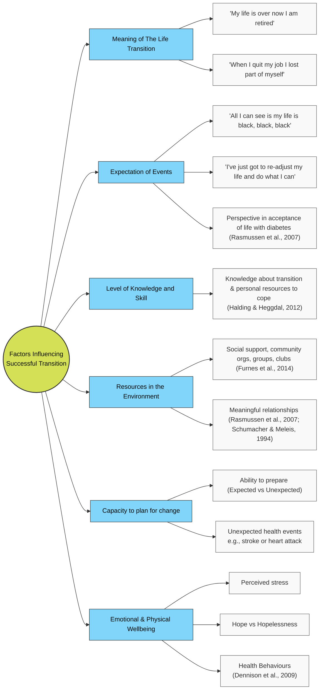
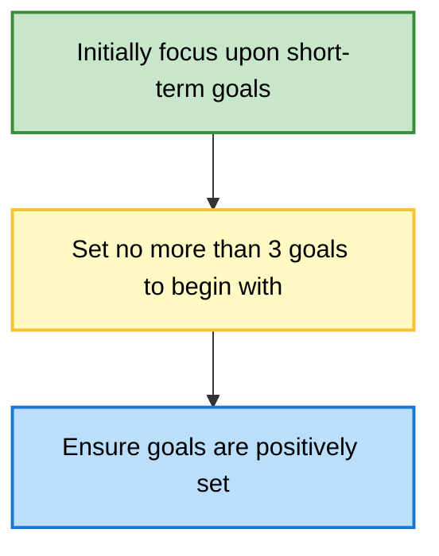

| Time              | Session Title            | Key Activities                                             |
| :---------------- | :----------------------- | :--------------------------------------------------------- |
| **09:00 – 09:25** | Optional Drop-in Support | Q&A with the teaching team                                 |
| **09:30 – 09:40** | Introduction to Day 3    | Review of Day 2; Shared Understanding & Treatment Planning |
| **09:40 – 10:45** | Maintenance Cycles       | Info-giving, Roleplay, Treatment Planning & COM-B          |
| **10:45 – 11:00** | **Break**                | —                                                          |
| **11:00 – 12:30** | LTCs & Physical Symptoms | Transition/Adjustment, Group Task, Problem Solving & SOC   |
| **12:30 – 13:30** | **Lunch**                | —                                                          |
| **13:30 – 14:00** | Physical Symptoms Diary  | Lecture and Discussion                                     |
| **14:00 – 15:15** | Activity Management      | Pacing Strategies & Small Group Discussions                |
| **15:15 – 15:30** | **Break**                | —                                                          |
| **15:30 – 16:20** | Pacing (Continued)       | Continued Strategies & Small Group Discussions             |
| **16:20 – 16:30** | Wrap-up                  | Final Questions & Reflections                              |

# Lecture 1 - Information Giving, Developing Shared Understanding & Treatment Planning 

- Consideration around delivering the probable diagnosis
- Introducing CBT model, highlighting links between mental and physical health
- Promoting physical health benefits of CBT
- Information giving – roleplay example and opportunity
- Additional areas to consider in treatment planning
- Use of COM-B

## Probable Diagnosis 

Provide with context of any relevant/ impacted/ impacting LTC(s)/PPS Example: “From everything you’ve told me today, and the symptoms you are having, this would indicate that you are experiencing something called depression. Have you heard of this condition? " "You’ve also explained that how you are feeling is making it more difficult for you to manage your Diabetes effectively." 

Give appropriate information about Probable Diagnosis as usual, acknowledging any links to LTC(s)/ PPS Example: “It is really common to feel tired and lethargic when experiencing depression. and as you mentioned this can be worse during hyperglycaemia when your blood glucose levels are particularly high for a period of time.

## Introduce the CBT Model 
Introduce the CBT model using their example to explain their cycle and it's links to LTC.

**T1 Diabetes**
![[Pasted image 20260323095143.png]]

**COPD**
![[Pasted image 20260323095827.png]]

Highlight how it impacts the ABCEs
- How this has a knock on effect on LTCs (how pain or fatigue is experienced) or self-management and regulation. 

 It can be helpful to link the physical health benefits of CBT here:
- Can help self-management 
- Can increase activity 
- Can improve pacing 

Other considerations:
- Signposting
- Integrated/Collaborative care approach 
- Signposting Alongside 

### Additional Areas to Consider 
- **Transition** - What is it like to live with LTCs? Have they made any changes to adapt already? What is helpful vs unhelpful? Feeling stuck?
- **Illness Beliefs** - Personal understanding and Interpretations of LTC/PPS and associated symptoms.
- **Barriers** - intrinsic/ extrinsic, practical, emotional, social, cultural, or systemic obstacles to engagement
- **Self-Management** - understanding of and adherence to guidance, current coping strategies, strengths, and resources
- **Safety** - safeguarding, carer/ cared for, dependants, suicide/self-harm, access to means, self-neglect

## COM-B 
Following usual practice but consider above more specifically:
- Less opportunity 
- Motivation based on previous experience 
- Physical and Cognitive resources for typical LICBT. 

> [!info]+ Consider the following
> David is diagnosed with stable angina. After seeing his GP concerned about his 'heart racing and trembling', fearing he may have a heart attack, his GP ran some tests. 
> 
> These were all negative, and David was referred to the PWP for possible Panic Disorder, which he knew nothing about (-**Capability**). He has a very supportive partner (Alice) (+**Opportunity**) but is concerned that because he has taken so much time off already to sort the angina, he may sick pay if he takes off more (- **Motivation**/-**Opportunity**). He is keen to somehow get the problem sorted however and attends the first session just to see what may be offered (+**Motivation**). David described many beliefs about angina that his PWP had previously learnt from the GP Practice nurse were not actually accurate (-**Capability**) and when patients wrongly thought this it predicted poor adjustment and lower quality of life.

## Lecture 2 - Supporting Transition and Adjustments to Living with LTCs
What this covers: 
- What do we mean by transitions and adjustment?
- What factors affect how well people adjust?
- What can we do as part of LICBT work to support this? 

### Transitions 
 - Periods when life events require individuals to redefine who they are and develop or redevelop their skills (Kralik et al 2006)
 - Can lead to loss of self or identity, disruptions to close relationships, impacts on daily functioning (Kralik et al 2006)
 - Patients may or may not undergo a transition or adjustment to ill health
 - Understanding can be used to inform psychological treatment 
 - Acknowledgement can help the patient to engage and adjust to ill health

TLDR: A period of psychological and structural change where an individual moves from one life stage, role, or state of being to another. It is typically understood not just as a situational shift, but as the internal psychological process of adapting to that shift.

- **Key components:** Relinquishing a previous role or reality, navigating an ambiguous "in-between" phase (liminality), and constructing a new identity or routine.
![[Pasted image 20260323120036.png]]

> [!question]+ Why is it important to consider adjustment?
> - Illness acceptance is associated with higher levels of subjective health (Karademas, Tsagaraki & Lambrou, 2009)
> 
> - Acceptance of pain, which includes participation in important life activities despite pain, is associated with more positive emotional functioning (Craner et al., 2017).
> 
> - Denial leads to poorer illness management, higher levels of distress, and depression.  (Karlsen & Bru, 2002; Bechtold Kortte et al., 2003; Jones, 2003).
> 

### Grief Model (Kubler-Ross's Five Stages of Grief)
People move through five stagfes of emotional adjustment following loss: denial, anger, bargaining, depression and the final stage of acceptance.

In this model normal adjustment means that there is an inverse relationship between acceptance and denial. 

NOTE: It is not linear and we can slide into any stages at any time. 

![[Pasted image 20260323115533.png]]

### Adjustment as Integration

What is it? 
The behavioral and cognitive process of maintaining or restoring balance (homeostasis) between an individual's needs and the demands of their environment.

- **Key components:** Utilizing coping mechanisms to manage acute stressors, resolve conflicts, or adapt to new circumstances. When this process fails to restore baseline functioning or causes significant impairment, it is clinically categorized as an adjustment disorder.

| Paterson (2001)                                                                                                                                                    | Kralik (2002)                                                                                                                                     | Jarrett (2000)                                                  | Whittemore & Dixon                                                                                         |
| :----------------------------------------------------------------------------------------------------------------------------------------------------------------- | :------------------------------------------------------------------------------------------------------------------------------------------------ | :-------------------------------------------------------------- | :--------------------------------------------------------------------------------------------------------- |
| **Illness in foreground** – focus on illness, symptoms and negative outcomes of disease. View disease as controlling life. Absorbed in illness.                    | **Extraordinariness** – phase of turmoil and distress. State of feeling alienated from familiar life and loss of control over life circumstances. | Stage of uncertainty Stage of disruption                     | **Living an illness** – stages of shifting sands, staying afloat, and weathering storms. Focus on illness. |
| **Wellness in foreground** – focus on being as well as possible. Emphasis on the self not the diseased body. Envision opportunity and possibility despite illness. | **Ordinariness** – phase of reconstructing life with illness. Finding a place for the illness to fit into context of life.                        | Stage of striving to regain self Stage of regaining wellness | **Living a life** – stage of rescuing oneself and navigating a life. Focus on meaningful life pursuits.    |

![[Pasted image 20260323112752.png]]
This flow-chart looks at adjustment as having a helpful representation/schemas of themselves and the world. If there is negative or unhelpful schemas then the outcome is anxiety and low mood. 

TLDR for Integration: The process of synthesizing disparate psychological elements—such as thoughts, emotional responses, traumatic memories, or a new physical condition—into a cohesive and unified sense of self.

- **Key components:** Moving beyond initial coping or adjustment to fully incorporate an experience into one's overarching life narrative. The experience is no longer a separate, disruptive force but a manageable, assimilated part of the individual's identity.

#### What Factors Influence Successful Transition?

**Meaning of The Life Transition**
- My life is over now I am retired 
- When I quit my job is lost part of myself

**Expectation of Events**
- All I can see is my life is black, black, black 
- ‘I think you’ve got to be realistic... I’ve just got to re-adjust my life and do what I can’
- Perspective in acceptance of life with diabetes (Rasmussen et al., 2007)

**Level of Knowledge and Skill**
- Amount of Knowledge the person has about their transition and the personal resources to cope (Halding & Heggdal, 2012)

**Resources available in the Environment**
- Different resources, e.g., social support, community organisations, groups, clubs, that may provide some form of support (Furnes et al., 2014) 
- Meaningful relationships (Rasmussen et al., 2007) (Schumacher & Meleis, 1994)

**Capacity to plan for change**
- How well one is able to prepare for it (Expected vs Unexpected)
- This may not always be possible with unexpected health events e.g stroke or heart attack

**Emotional and Physical Wellbeing** (Dennison et al, 2009)
- Perceived stress
- Hope vs Hopelessness 
- Health Behaviours 

## Supporting Transition to LTC/PPS using LICBT interventions

We will focus on the following:
- Goal Setting 
- Problem Solving 
- SOC principles

### Goal Setting

> [!tldr]+ What is it?
> ‘Goal setting is an evidence-based low-intensity intervention that **patients can use to help adapt or revise their goals when their personal circumstances change, for example as part of a transition into illhealth.** It is a **collaborative** process of deciding on something **the patient wants to achieve, involving planning how to get it, and then progressively working towards it** in a systematic, structured and potentially graded fashion.’

There is a strong evidence-base for this:
- A fundamental feature of many LTC self management programs 
	- Diabetes (Langford et al., 2007; DeWalt et al., 2009) 
	- Acquired brain injury (Bouwens et al., 2009) 
	- Angina (Lewin et al., 2001) 
- Higher levels of goal disturbance predicted lower levels of wellbeing post-cancer diagnosis (Janse et al., 2016) 
- General Research (not LTC-specific): Setting proximal (short-term and specific) rather than long-term goals is often more effective (Locke & Latham, 2002)

### Why Use Goal Setting with LTC's 
The transition to living with a health condition may require patients to amend their goals to accommodate changes imposed by their health. 

Failure to adapt goals to encourage adapting to life with LTCs increased vulnerability. 

It may also mean that they are unsure of what their own goals are! They may: 
- Have a lack of or inaccurate knowledge about what can and cannot be achieved with physical health condition. 
- Difficulty accepting new limitations or self-management guidance
- Depression/Anxiety may impact perspective or willingness to accept or adjust. 

**Goal setting ensures realistic goal setting**
- Helps reduce patient's focus on what they can't do and over-generalised thinking
- SOC principles can be integrated into intervention 

#### What are the indicators for goal setting?
FIrstly, explore the issues around transition and how well they have adjust or adapted thier own goals to accomodate their new physical health problems. 

- [ ] Do they have behaviours that relate to giving things up completely or rigidly trying to keep things the same as before the LTC?
- [ ] Do they have thoughts over-generalising of how to adjust to LTC life?
	- I have had to give up with everything?
	- I won't let it get in the way! 
	- I want things to stay the same or go back to how they were!

#### Goal setting "Rules"

Break these goals down using the SMART Goals: 

| SMART Principle   | Clinical Considerations & Prompt Questions                                                                                  |
| :---------------- | :-------------------------------------------------------------------------------------------------------------------------- |
| **Specific**      | Be very clear what you want to achieve. Goal can be broken down.                                                            |
| **Measurable**    | How will you know when you have achieved the goal?                                                                          |
| **Achievable**    | Can the goal (still) be achieved? Has the LTC made this difficult or impossible? Further adaptation needed? SOC principles? |
| **Relevant**      | Are the goals relevant to recovery (and better self-management?) in short term?                                             |
| **Time Specific** | What is the time limit? Session-by-session progress supported?                                                              |

### Problem-Solving 