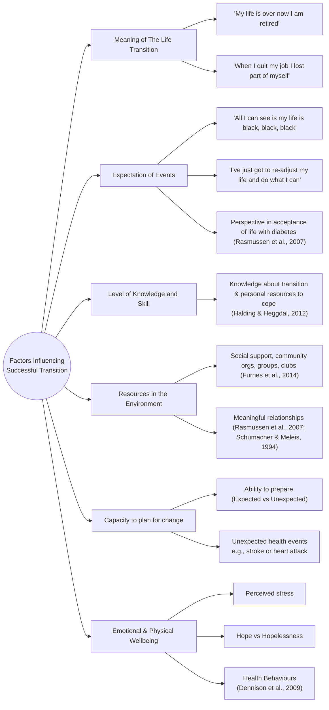
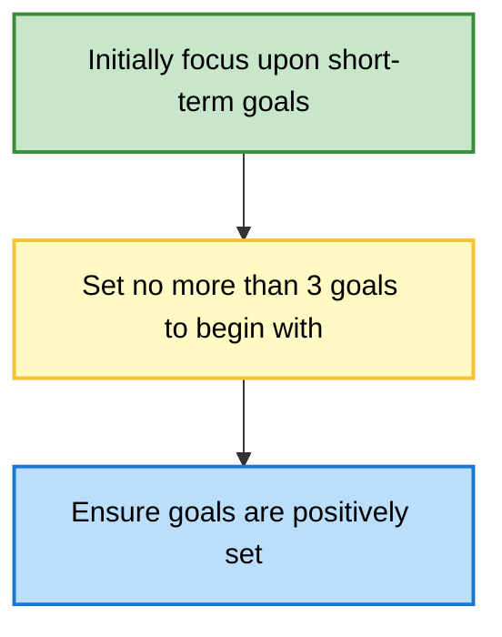
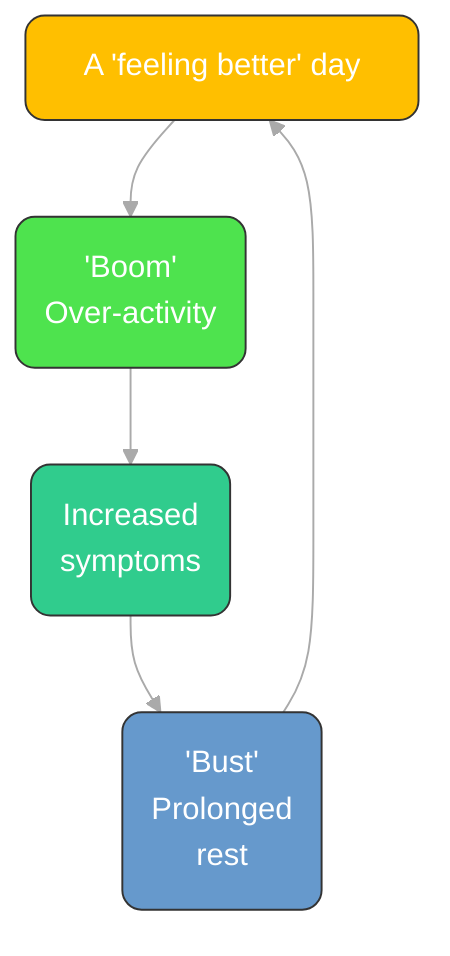

| Time              | Session Title            | Key Activities                                             |
| :---------------- | :----------------------- | :--------------------------------------------------------- |
| **09:00 – 09:25** | Optional Drop-in Support | Q&A with the teaching team                                 |
| **09:30 – 09:40** | Introduction to Day 3    | Review of Day 2; Shared Understanding & Treatment Planning |
| **09:40 – 10:45** | Maintenance Cycles       | Info-giving, Roleplay, Treatment Planning & COM-B          |
| **10:45 – 11:00** | **Break**                | —                                                          |
| **11:00 – 12:30** | LTCs & Physical Symptoms | Transition/Adjustment, Group Task, Problem Solving & SOC   |
| **12:30 – 13:30** | **Lunch**                | —                                                          |
| **13:30 – 14:00** | Physical Symptoms Diary  | Lecture and Discussion                                     |
| **14:00 – 15:15** | Activity Management      | Pacing Strategies & Small Group Discussions                |
| **15:15 – 15:30** | **Break**                | —                                                          |
| **15:30 – 16:20** | Pacing (Continued)       | Continued Strategies & Small Group Discussions             |
| **16:20 – 16:30** | Wrap-up                  | Final Questions & Reflections                              |

# Lecture 1 - Information Giving, Developing Shared Understanding & Treatment Planning 

- Consideration around delivering the probable diagnosis
- Introducing CBT model, highlighting links between mental and physical health
- Promoting physical health benefits of CBT
- Information giving – roleplay example and opportunity
- Additional areas to consider in treatment planning
- Use of COM-B

___
## Probable Diagnosis 

Provide with context of any relevant/ impacted/ impacting LTC(s)/PPS Example: “From everything you’ve told me today, and the symptoms you are having, this would indicate that you are experiencing something called depression. Have you heard of this condition? " "You’ve also explained that how you are feeling is making it more difficult for you to manage your Diabetes effectively." 

Give appropriate information about Probable Diagnosis as usual, acknowledging any links to LTC(s)/ PPS Example: “It is really common to feel tired and lethargic when experiencing depression. and as you mentioned this can be worse during hyperglycaemia when your blood glucose levels are particularly high for a period of time.

## Introduce the CBT Model 
Introduce the CBT model using their example to explain their cycle and it's links to LTC.

**T1 Diabetes**
![[Pasted image 20260323095143.png]]

**COPD**
![[Pasted image 20260323095827.png]]

Highlight how it impacts the ABCEs
- How this has a knock on effect on LTCs (how pain or fatigue is experienced) or self-management and regulation. 

 It can be helpful to link the physical health benefits of CBT here:
- Can help self-management 
- Can increase activity 
- Can improve pacing 

Other considerations:
- Signposting
- Integrated/Collaborative care approach 
- Signposting Alongside 

### Additional Areas to Consider 
- **Transition** - What is it like to live with LTCs? Have they made any changes to adapt already? What is helpful vs unhelpful? Feeling stuck?
- **Illness Beliefs** - Personal understanding and Interpretations of LTC/PPS and associated symptoms.
- **Barriers** - intrinsic/ extrinsic, practical, emotional, social, cultural, or systemic obstacles to engagement
- **Self-Management** - understanding of and adherence to guidance, current coping strategies, strengths, and resources
- **Safety** - safeguarding, carer/ cared for, dependants, suicide/self-harm, access to means, self-neglect

___
## COM-B 
Following usual practice but consider above more specifically:
- Less opportunity 
- Motivation based on previous experience 
- Physical and Cognitive resources for typical LICBT. 

> [!info]+ Consider the following
> David is diagnosed with stable angina. After seeing his GP concerned about his 'heart racing and trembling', fearing he may have a heart attack, his GP ran some tests. 
> 
> These were all negative, and David was referred to the PWP for possible Panic Disorder, which he knew nothing about (-**Capability**). He has a very supportive partner (Alice) (+**Opportunity**) but is concerned that because he has taken so much time off already to sort the angina, he may sick pay if he takes off more (- **Motivation**/-**Opportunity**). He is keen to somehow get the problem sorted however and attends the first session just to see what may be offered (+**Motivation**). David described many beliefs about angina that his PWP had previously learnt from the GP Practice nurse were not actually accurate (-**Capability**) and when patients wrongly thought this it predicted poor adjustment and lower quality of life.

___
## Lecture 2 - Supporting Transition and Adjustments to Living with LTCs
What this covers: 
- What do we mean by transitions and adjustment?
- What factors affect how well people adjust?
- What can we do as part of LICBT work to support this? 

### Transitions 
 - Periods when life events require individuals to redefine who they are and develop or redevelop their skills (Kralik et al 2006)
 - Can lead to loss of self or identity, disruptions to close relationships, impacts on daily functioning (Kralik et al 2006)
 - Patients may or may not undergo a transition or adjustment to ill health
 - Understanding can be used to inform psychological treatment 
 - Acknowledgement can help the patient to engage and adjust to ill health

TLDR: A period of psychological and structural change where an individual moves from one life stage, role, or state of being to another. It is typically understood not just as a situational shift, but as the internal psychological process of adapting to that shift.

- **Key components:** Relinquishing a previous role or reality, navigating an ambiguous "in-between" phase (liminality), and constructing a new identity or routine.
![[Pasted image 20260323120036.png]]

> [!question]+ Why is it important to consider adjustment?
> - Illness acceptance is associated with higher levels of subjective health (Karademas, Tsagaraki & Lambrou, 2009)
> 
> - Acceptance of pain, which includes participation in important life activities despite pain, is associated with more positive emotional functioning (Craner et al., 2017).
> 
> - Denial leads to poorer illness management, higher levels of distress, and depression.  (Karlsen & Bru, 2002; Bechtold Kortte et al., 2003; Jones, 2003).
> 

___

### Grief Model (Kubler-Ross's Five Stages of Grief)
People move through five stagfes of emotional adjustment following loss: denial, anger, bargaining, depression and the final stage of acceptance.

In this model normal adjustment means that there is an inverse relationship between acceptance and denial. 

NOTE: It is not linear and we can slide into any stages at any time. 

![[Pasted image 20260323115533.png]]

___

### Adjustment as Integration

What is it? 
The behavioral and cognitive process of maintaining or restoring balance (homeostasis) between an individual's needs and the demands of their environment.

- **Key components:** Utilizing coping mechanisms to manage acute stressors, resolve conflicts, or adapt to new circumstances. When this process fails to restore baseline functioning or causes significant impairment, it is clinically categorized as an adjustment disorder.

| Paterson (2001)                                                                                                                                                    | Kralik (2002)                                                                                                                                     | Jarrett (2000)                                                  | Whittemore & Dixon                                                                                         |
| :----------------------------------------------------------------------------------------------------------------------------------------------------------------- | :------------------------------------------------------------------------------------------------------------------------------------------------ | :-------------------------------------------------------------- | :--------------------------------------------------------------------------------------------------------- |
| **Illness in foreground** – focus on illness, symptoms and negative outcomes of disease. View disease as controlling life. Absorbed in illness.                    | **Extraordinariness** – phase of turmoil and distress. State of feeling alienated from familiar life and loss of control over life circumstances. | Stage of uncertainty Stage of disruption                     | **Living an illness** – stages of shifting sands, staying afloat, and weathering storms. Focus on illness. |
| **Wellness in foreground** – focus on being as well as possible. Emphasis on the self not the diseased body. Envision opportunity and possibility despite illness. | **Ordinariness** – phase of reconstructing life with illness. Finding a place for the illness to fit into context of life.                        | Stage of striving to regain self Stage of regaining wellness | **Living a life** – stage of rescuing oneself and navigating a life. Focus on meaningful life pursuits.    |

![[Pasted image 20260323112752.png]]
This flow-chart looks at adjustment as having a helpful representation/schemas of themselves and the world. If there is negative or unhelpful schemas then the outcome is anxiety and low mood. 

**TLDR**: The process of synthesizing disparate psychological elements—such as thoughts, emotional responses, traumatic memories, or a new physical condition—into a cohesive and unified sense of self.

- **Key components:** Moving beyond initial coping or adjustment to fully incorporate an experience into one's overarching life narrative. The experience is no longer a separate, disruptive force but a manageable, assimilated part of the individual's identity.

___
#### What Factors Influence Successful Transition?

**Meaning of The Life Transition**
- My life is over now I am retired 
- When I quit my job is lost part of myself

**Expectation of Events**
- All I can see is my life is black, black, black 
- ‘I think you’ve got to be realistic... I’ve just got to re-adjust my life and do what I can’
- Perspective in acceptance of life with diabetes (Rasmussen et al., 2007)

**Level of Knowledge and Skill**
- Amount of Knowledge the person has about their transition and the personal resources to cope (Halding & Heggdal, 2012)

**Resources available in the Environment**
- Different resources, e.g., social support, community organisations, groups, clubs, that may provide some form of support (Furnes et al., 2014) 
- Meaningful relationships (Rasmussen et al., 2007) (Schumacher & Meleis, 1994)

**Capacity to plan for change**
- How well one is able to prepare for it (Expected vs Unexpected)
- This may not always be possible with unexpected health events e.g stroke or heart attack

**Emotional and Physical Wellbeing** (Dennison et al, 2009)
- Perceived stress
- Hope vs Hopelessness 
- Health Behaviours 

___
## Supporting Transition to LTC/PPS using LICBT interventions

We will focus on the following:
- Goal Setting 
- Problem Solving 
- SOC principles

### Goal Setting

> [!tldr]+ What is it?
> ‘Goal setting is an evidence-based low-intensity intervention that **patients can use to help adapt or revise their goals when their personal circumstances change, for example as part of a transition into illhealth.** It is a **collaborative** process of deciding on something **the patient wants to achieve, involving planning how to get it, and then progressively working towards it** in a systematic, structured and potentially graded fashion.’

There is a strong evidence-base for this:
- A fundamental feature of many LTC self management programs 
	- Diabetes (Langford et al., 2007; DeWalt et al., 2009) 
	- Acquired brain injury (Bouwens et al., 2009) 
	- Angina (Lewin et al., 2001) 
- Higher levels of goal disturbance predicted lower levels of wellbeing post-cancer diagnosis (Janse et al., 2016) 
- General Research (not LTC-specific): Setting proximal (short-term and specific) rather than long-term goals is often more effective (Locke & Latham, 2002)

### Why Use Goal Setting with LTC's 
The transition to living with a health condition may require patients to amend their goals to accommodate changes imposed by their health. 

Failure to adapt goals to encourage adapting to life with LTCs increased vulnerability. 

It may also mean that they are unsure of what their own goals are! They may: 
- Have a lack of or inaccurate knowledge about what can and cannot be achieved with physical health condition. 
- Difficulty accepting new limitations or self-management guidance
- Depression/Anxiety may impact perspective or willingness to accept or adjust. 

**Goal setting ensures realistic goal setting**
- Helps reduce patient's focus on what they can't do and over-generalised thinking
- SOC principles can be integrated into intervention 

#### What are the indicators for goal setting?
FIrstly, explore the issues around transition and how well they have adjust or adapted thier own goals to accomodate their new physical health problems. 

- [ ] Do they have behaviours that relate to giving things up completely or rigidly trying to keep things the same as before the LTC?
- [ ] Do they have thoughts over-generalising of how to adjust to LTC life?
	- I have had to give up with everything?
	- I won't let it get in the way! 
	- I want things to stay the same or go back to how they were!

#### Goal setting "Rules"

Break these goals down using the SMART Goals: 

| SMART Principle   | Clinical Considerations & Prompt Questions                                                                                  |
| :---------------- | :-------------------------------------------------------------------------------------------------------------------------- |
| **Specific**      | Be very clear what you want to achieve. Goal can be broken down.                                                            |
| **Measurable**    | How will you know when you have achieved the goal?                                                                          |
| **Achievable**    | Can the goal (still) be achieved? Has the LTC made this difficult or impossible? Further adaptation needed? SOC principles? |
| **Relevant**      | Are the goals relevant to recovery (and better self-management?) in short term?                                             |
| **Time Specific** | What is the time limit? Session-by-session progress supported?                                                              |
___
### Problem-Solving 

> [!tldr]+ What is it?
> “Problem solving is an evidence-based low intensity intervention which patients can use when their problems appear initially too big to solve. It is a practical approach which works by helping patients take a step back from their problems and consider what solutions might actually exist. It takes a systematic and step by step approach to what might seem overwhelming difficulties. ”

> [!question]- Why do it?
> LTC Patients with depression may experience difficulties with solving problems for a number of reasons: 
> - THe impact may expose to novel problems that cannot be easily solved or have not been solved before effectively (think com-b)
> - CMHP can prevent effective problem solving.
> - Cognitive impact and burden of LTCs.
> 
> Depression may impair PS ability (Martell et al., 2010)
> - This may be as a result of impaired executive functioning or through an increase in over-generalised styles of thinking
> 

#### Indicators of Problem-Solving
Patient reports impacts of difficulties/symptoms are around daily problems (Financial, fitting things in with treatment, work). 
- Thoughts may be around not knowing how to complete or engage RPN tasks. 
- Need to problem solve causes significant barriers to engaging in other LTC intervention e.g not able to break down tasks or complete BA tasks. 

___
### SOC Model 
SOC was designed around successful aging through decline or lifestyle change. 
- Adopting SOC strategies has been found to be adaptive for older adults, resulting in higher levels of wellbeing despite reduction in resources (Jopp & Smith, 2006.
  - Older adults with osteoarthritis use the SOC model to adapt to living with their long-term condition (Gignac, Cott & Badley, 2000). 
  - SOC helps older adults with single and multiple chronic conditions to lead healthy and meaningful lives (Zhang & Radhakrishnan, 2018).

#### Tools 
**Selection**
- Reduction in the number of goals to allow more focused energy and motivation to be aimed at most important goals or select new goals in light of limitations. 

**Optimisation**
- Despite limitations, individuals work towards high levels by focusing the resources they do have towards the goal. 

**Compensation**
- New limitations are recognised and alternative means of working towards goals are employed. 

Consider the following examples: 

| | Exercise & Fitness | Memory Difficulties | Parenting | Friendships |
| :--- | :--- | :--- | :--- | :--- |
| **S** | Prioritising forms of fitness we find most enjoyable | Focusing on the most important information e.g. names, dates/ times | ‘Pick your battles’ – putting more effort into the aspects that matter most to you | Spending time with close friends rather than larger groups |
| **O** | Training regularly Improving technique | Repetition, writing something down to process more deeply | Learning new strategies and practicing these | Investing time and effort into meaningful relationships |
| **C** | Using supports e.g. muscle-support tape Use of lighter weights | Using phone reminders or calendars | Asking for help if overwhelmed | Using texting/ social media for frequent contact if unable to regularly meet in person |
####  Examples of it in LICBT Practice 

| | Rheumatoid arthritis | Multiple Sclerosis | Stroke | COPD | Parkinsons |
| :--- | :--- | :--- | :--- | :--- | :--- |
| **Challenges** | Joint pain & stiffness. Daily tasks esp those involving fine motor movements are difficult to engage with. | Severe fatigue. Difficulty maintaining routine and engaging with valued activities. | Weakness on one side of the body. Daily tasks are difficult to engage with/ complete. | Breathlessness makes household tasks difficult. | Tremors and slowed movement. Difficulty with daily tasks esp. tasks involving fine motor skills. |
| **Selection** | Prioritises essential daily tasks such as dressing independently and preparing simple meals. | Prioritises the most essential and meaningful activities such as caring for children. | Prioritises essential daily tasks such personal care and eating. | Prioritises tasks that are most meaningful such as cooking for family. | Focuses on preparing simple meals rather than complex recipes. |
| **Optimisation** | An **Occupational Therapist** can teach **hand exercises** and **joint protection techniques** to make tasks easier. | **Plan structured routines** (e.g. activities requiring most energy in the morning) and use of **pacing strategies**. | An **Occupational Therapist** can support **task-specific training** to strengthen motor skills. | **Breathing techniques** and **energy conservation**. | An **Occupational Therapist** focuses on **movement strategies** and **repetitive practice** to improve coordination. |
| **Compensation** | Adaptive equipment such a jar openers and lightweight kitchen tools. | Mobility aids, sitting while preparing meals, scheduling rest breaks. | Learning one-handed techniques and use of adaptive tools like non-slip mats and dressing aids. | Adaptive equipment such as perching stools and lightweight kitchen tools. | Adaptive equipment such as weighted utensils, grab rails, walking aids and voice-to-text tools. |

> [!tldr]+ Key Messages
> There are different models to understand transitions that people go through. They can be used to aid our own understanding of our patients experiences.
> 
> There are things we can do such as Goal Setting and Problem Solving within LICBT treatment patients.
>  
> SOC Principles can be applied to ocnsider ways to best engage with an activity despite LTC barriers.

___
## Physical Symptom Diary
This is designed to help PWPs and patients explore the relationship between mental health, physical health, and daily behaviours to inform treatment.

### Purpose and Structure of the Diary
Unlike a standard behavioural activation (BA) baseline diary, this tool requires patients to record the **strength of specific physical symptoms** (such as pain, fatigue, or breathlessness) alongside their activities and emotional states.

- **Detailed Tracking:** The diary provides a page-per-day format to capture significant detail.
- **Information Gathering:** It serves as an extension of the assessment, helping to build a "Five Areas" shared understanding when the initial picture is unclear.
- **Versatility:** It can be used for both medically explained conditions (e.g., COPD, MS) and medically unexplained symptoms (MUS).
    

---

### Clinical Utility in Treatment

The data gathered from the diary supports several therapeutic goals:

| **Goal**                    | **Clinical Application**                                                                                                                          |
| --------------------------- | ------------------------------------------------------------------------------------------------------------------------------------------------- |
| **Rationale for Treatment** | If the diary shows that physical symptoms worsen as mood drops, it provides a strong rationale for targeting mental health to disrupt this cycle. |
| **Informing BA & Pacing**   | Identifying specific thresholds (e.g., "walking for 30 minutes causes a flare-up") allows for safer, sustainable activity planning.               |
| **Challenging Beliefs**     | Objective data can challenge unhelpful illness beliefs, such as the idea that a condition is "steadily worsening" when it actually fluctuates.    |
| **Differential Diagnosis**  | Helping patients distinguish between symptoms of a physical condition (e.g., COPD) and symptoms triggered by anxiety/panic.                       |

---

### Challenges and Considerations

The lecture highlights several factors that can complicate data interpretation or patient engagement:

- **Post-Exertional Malaise (PEM):** In conditions like Chronic Fatigue Syndrome (ME/CFS), symptoms may be delayed by up to **48 hours** after the triggering activity.
- **Erratic Patterns:** Conditions like Long Covid may present as unpredictable relapse/recovery cycles rather than clear cause-and-effect patterns.
- **Treatment Burden:** Adding a diary to the routine of someone already managing a complex long-term condition (LTC) can be overwhelming.
- **Level of Detail:** Practitioners must ensure patients record "unseen" activities like resting or skipped meals to get an accurate picture.
### Summary of Outcomes
Effective use of the diary increases a patient's **perceived control** over their symptoms and reduces hopelessness. By using evidence gathered through the diary, the PWP can ensure that behavioral interventions do not accidentally exacerbate physical symptoms, leading to better long-term sustainability.

## Pacing 
Often with LTCs there is a requirement of adjusting activity levels to remain within their own limits whilst acknowledging the barriers of their LTCs. 

**What is Pacing?**
It is an approach to activity to help increase strength, tolerance and function for exercise/activity.

Can be a helpful strategy to incorporate to increase a patient’s ability to engage successfully with BA 

Can be particularly useful for managing pain or fatigue as part of various conditions. 

Example: 
- Some people with persistent pain reduce their physical activity because it hurts 
- Other people push their limits too far and overdo the activity, stopping when it’s too late and high pain levels are experienced 
	- Some of the advice around there can be confusing and contradictory!
	- e.g. the word ‘pacing’ used to mean different things…, advice to gradually increase activities over time vs. this not always being helpful

### Boom and Bust Cycle 

### Deconditioning
“Deconditioning refers to the changes in the body that occur during a period of time when you are not active (inactivity). The changes happen in the heart, lungs, and muscles. They make you feel tired and weak (fatigued) and decrease your ability to be active. The three stages of deconditioning include:
- Mild deconditioning: a change in your ability to do your usual exercise activities, such as running, biking, or swimming. 
- Moderate deconditioning: a change in your ability to do normal everyday activities, such as walking, shopping for groceries, and doing chores. 
- Severe deconditioning: in this stage, you may not be able to do minimal activity or usual self-care.

In some conditions, reduced activity levels results in deconditioning which worsens the physical health condition: 
- COPD 
- Coronary Heart Disease 
- Diabetes 
- Some Chronic Pain conditions

Examples of Pacing Guidance to prevent deconditioning and worsening LTC

Heart Event
“Gentle walking is the best way to start, even if it’s just for two minutes. Do what you can manage. Do it every day until it feels easier, then increase the time, and later the speed. Aim to be exercising for 15–20 minutes at a time by weeks four to six. By this time you should also have started attending cardiac rehabilitation sessions.” [BNF](https://www.bhf.org.uk/informationsupport/heart-matters-magazine/activity/first-exercise-steps)

COPD Breathlessness Manual: 
- Pacing Yourself: Some of your normal daily activities such as walking, stairs, getting dressed and hanging laundry out may now present themselves as a struggle and cause breathlessness. Combine breathing control and positions of ease when you are feeling breathless. If you are carrying out a task such as making a bed, simply stop and adopt a position of ease. Continue the task when your breathing has returned to normal. Never rush to complete a task as this will make the breathlessness worse 
- You should aim for the exercises to be at a moderate level for you. Once they get fairly easy, to build fitness, increase the time spent exercising at a pace that is comfortable for you. As a guide, this could be an increase of 30 seconds each time.

### Types of pacing:

Time-Contingent Pacing 
- Informed by diary - How long can an activity be carried out before symptoms worsen?
- Time-Contingent Pacing = Activity is carried out for a predetermined amount of time

A baseline of 50-75% of this time may be helpful and refine from there

Creating a pacing plan for the person:
- What is a rest?
- Can we switch activity rather than rest?

> More appropriate where ongoing symptoms, impairment and worsening condition perpetuated by reduced activity and consequent deconditioning

Symptom-Contingent Pacing 
- Where Activity is carried out until symptoms reach a particular level 
	- Recommended for CFS by Goudsmit, Nijs, Jason and Wallman, (2012)

#### Paradoxical impact of physical activity
- Long-Covid can have erratic relapse-recovery cycles
- MS is not just about doing more as it is progressive 
- CFS has now removed graded exercise therapy - Stop when it starts.

### Post-Exertional Malaise 
We know that reduced activity in favour of rest can be useful and helpful when used in a self-management way. It can also be done out of fear or avoidance of activity/expected symptoms. 

> "The worsening of symptoms that can follow minimal cognitive, physical, emotional or social activity, or activity that could previously be tolerated. Symptoms can typically worsen 12 to 48 hours after activity and last for days or even weeks, sometimes leading to a relapse. Post-exertional malaise may also be referred to as post-exertional symptom exacerbation.” (NICE, 2021: ME/ CFS Guideline)

This doesn't need to be physical it can be cognitive or sensory following this. It can also be done about 24hrs post activity. 

### Pacing for CFS/ME

Pacing is a self-management strategy for activity. Patients who pace well are active when able, and rest when tired. They may plan extra rest ahead of strenuous activity. 

Pacing as self-management should not be seen as a treatment, but more as a way of coping with the impact of M.E. Taking a balanced, steady approach to activity counteracts any tendency to overdo things. Keeping your activity levels within sensible limits avoids overly aggravating your symptoms and prolonging the recovery phase after the increased activity.

**AVOID**
- Advising people to do MORE exercise that is not suggested by their healthcare practitioner. 
- Offering incremental increases in physical activity. 
- offer people with ME/CFS physical activity or exercise programmes that are based on deconditioning and exercise avoidance theories as perpetuating ME/CFS

**DO**
Discuss the principles of ‘energy management’ – a self-management strategy led by the person themselves with support from a healthcare professional in an ME/CFS specialist team 
- uses a flexible, tailored approach so that activity is never automatically increased but is maintained or adjusted (upwards after a period of stability or downwards when symptoms are worse)

Work with the person to establish an individual activity pattern within their current energy limits that minimises their symptoms: 
- Agree a sustainable level of activity as the first step, which may mean reducing activity. 
- Plan periods of rest and activity, and incorporate the need for pre-emptive rest. 
- Alternative and vary between different types of activity and break activities into small chunks. 

### Time-Contingent - Energy Envelope Model (2014)
Energy budget is imposed by illness 
- Investigate and assess your budget through observation and record keeping (Physical Symptoms Diary)
- Consider budget for one activity at a time
- Adapt the budget in a way which allows us to expand overall capacity 

Without Pacing: Lay 5 bricks in 30 minutes, exhausted for next 3 hours. Take 4 hours in total to lay 10 bricks (plus 3 hours of recovery time following)

With Pacing: Lay 2 bricks in 10 minutes, a little tired but not exhausted, have a rest for 10 minutes. Take 1 hour 40 minutes in total to lay 10 bricks (plus 10 minutes recovery time following).

### Symptom-Contingent Pacing 
Still have a plan for the duration and how much activity you will do but - you will have greater flexibility to account for your own personal response to exertion. This is because it can often be unpredictable and prevent exacerbation of symptoms resulting in prolonged rest and potentially avoidable distress associated with with unpleasant symptoms and loss of function) 

- Unlike time-contingent pacing, this strategy takes into account that the worsening of symptoms after activity: 
	- Are often delayed in onset by hours or days 
	- Are disproportionate to the activity 
	- Often result in a prolonged recovery time that may last hours, days, weeks or longer (adapted from NICE Guideline for ME/CFS (2021) with respect to the experience of PEM) 
	- This pattern may be evident from completion of Physical Symptom Diary.

## Incorporating Pacing or Energy Management into BA

![[Pasted image 20260323162114.png]]

**Which plan do we follow?**
If you feel worse/ having a bad day in terms of your health condition (e.g. CFS, Long Covid..) then yes stop or adjust your plan. If you feel worse in terms of your depression, it is likely to be more helpful to try to stick to the plan designed to bring about positive changes to your mood.

#### Managing Bad Days
How can I manage both physical and emotional symptoms at the same time?

There is always flexibility in our plans!
- If the activity is paced does this prevent physical symptoms being exacerbated in the first place?
- If we can still follow the plan but adjust the duration/intensity that feels right. 
- What did you want to get out of the activity?
	- Can we switch it out for a less exhausting alternative but we still value e.g can't read - listen to audiobooks.

“Pacing yourself will help you have enough energy to complete an activity. You’ll recover faster if you work on a task until you are tired rather than exhausted. The alternative, doing something until you’re exhausted, or going for the big push, means that you’ll need longer to recover.”

| The Pacing Approach                                                                                                           | The Big Push Approach                                                                                              |
| ----------------------------------------------------------------------------------------------------------------------------- | ------------------------------------------------------------------------------------------------------------------ |
| Climb five steps, rest for 30 seconds and repeat. You won’t need a long rest at the top and won’t feel so tired the next day. | Climb all the stairs at once. You’ll have to rest for 10 minutes at the top, and feel achy and tired the next day. |

You can find some specific examples of common tasks  here: https://www.rcot.co.uk/conserving-energy
