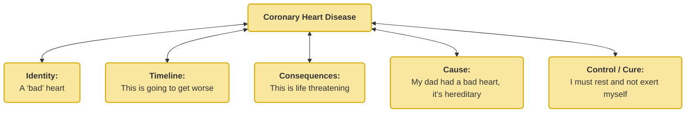
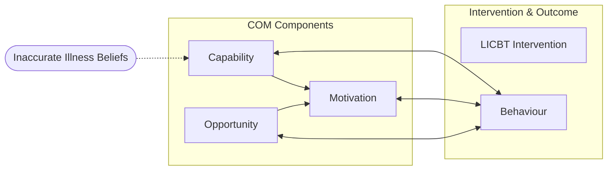
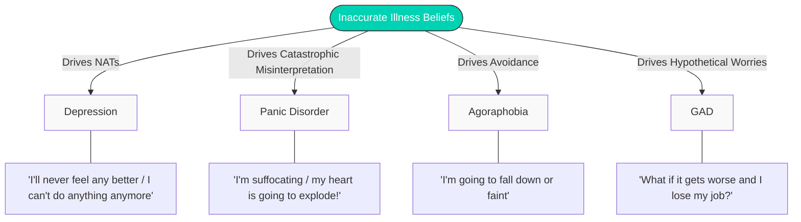

## Exploring Illness Beliefs to inform LICBT Support 

Outcomes of today: 
- How illness beliefs can impact the capability and motivation for behaviour change and can feed into the maintenance of problem.
- How they can impact how we respond to physical and mental health problems. 
- How inaccurate illness belief can lead to barriers in effective self-management. 
- How being aware of patient illness beliefs can help to provide more effective patient care. 

### Introduction 
An Illness belief is a belief or expectation held about an illness(es) or somatic symptoms being experienced. 

The Biopsychosocial Model considers illness not just the result of physical pathological factors but also psychosocial factors. This is because they can impact the way the problem is presented and the response to treatment. 

These beliefs are also didactic as those held by healthcare professionals and wider society also influence patient beliefs.

### Illness Representations 

#### Common-Sense Model of Illness
Self-Regulation Theory / Common Sense Model of Illness (Leventhal, 1970;Leventhal, Meyer & Nerenz, 1980). This is a framework used to understand how people handle illness. It suggests that when faced with a health threat, people don't just follow doctor's orders—they build their own "common sense" logic to manage it.

The model breaks down how a person processes a health issue into five steps:
1. **Awareness:** Noticing a symptom or health threat.
2. **Emotion:** Managing the feelings (like anxiety or fear) caused by the threat.
3. **Perception:** Forming a personal "theory" about what the illness is and how to fix it.
4. **Action:** Creating a plan to treat the problem.
5. **Feedback:** Checking if the plan is working and adjusting based on results.

There are several components to creating an Illness Representation:
1. **Identity** - Name/Label/Associated Symptoms
2. **Timeline** - Believed time duration/trajectory
3. **Consequences** - Believed impact/outcome
4. **Cause** - The causal event/mechanism
5. **Control/Cure** - Can something be done to control the threat 

Consider the following example: 

Here is the full model here: 
![[Pasted image 20260324113258.png]]

#### Measurement - How can we measure this?
Broadbent (2006)^[https://pubmed.ncbi.nlm.nih.gov/16731240/] created the Brief Illness Perception Questionnaire that measures this. 

Furze et al (2003) noted that people who have suffered a heart attack can hold misconceived or maladaptive beliefs and that these can have a deleterious effect on quality of life and functioning they noted: 
![[Pasted image 20260324115321.png]]

### What does this mean? (Implications)
Evidence shows that illness beliefs are consistent determinant of the QoL and Self-management than depression (Hampson, Glasgow & Stryker, 2000):
- Illness beliefs in depression affects outcomes (Lynch, Moore, Moss-Morris, Kendrick, 2015)
- Contributes to the mismatch between patient and professional (Cohen et al, 1994)
- Professionals acknowledging patient representations enhances person centredness (Noel et al, 2005)

Given link between illness representation and outcomes (including mental health) how can this understanding inform our practice?

## Lecture 2 - Illness Beliefs & CMHP Maintenance Cycles

Our illness beliefs can impact how we respond to physical health problems and mental health problems. 
- Inaccurate beliefs can lead to behaviours that worsen the condition e.g. poorer engagement in self-management leading to poorer outcomes. 
- Awareness of patients illness beliefs can aid patient centred care. 
- I also drives the patients motivation and ability to change. 

Consider the following beliefs: 

We have looked at the activity management and pacing to help support BA for patients with LTC's - this is only an indirect challenge to unhelpful illness beliefs around what the patient can and can't do. 

If these beliefs are quite strong of dominant that prevent engagement in activity - CR with BE can help challenge these unhelpful illness beliefs. 

### LICBT for Anxiety in the context of LTCs
It is important that we consider anxiety is often excessive and disproportionate to their situation and context.

Consider the following example: “Individuals with certain medical conditions may avoid situations because of realistic concerns of becoming incapacitated (e.g. fainting in an individual with transient ischaemic attacks) or embarrassed (e.g. diarrhoea in an individual with Crohn’s disease). The diagnosis should be given only when the fear or avoidance is clearly in excess of that usually associated with these medical conditions”.

Consider the Anxiety Level equation (This is commonly used at HI CBT):

$$
\text{Anxiety Level} = \frac{\text{Perceived Danger (cost} \times \text{likelihood)}}{\text{Perceived Coping (internal + external)}}
$$

The top is the worry itself (the driver) - the greater the cost and the more likely the perceived danger is the greater the worry. 

The bottom is what negates (or fails to) negate this - What are their beliefs (What do they believe will happen) , what support or reassurance do they have externally. 

Here is an example of it applied:

$$
\text{Anxiety Level} = \frac{\text{I'm likely to fall and seriously hurt myself}}{\text{I won't be able to get back up, and nobody will help}}
$$

 

$$
\text{Anxiety} = \frac{\text{Danger: "If I stutter, everyone will think I'm incompetent"}}{\text{Coping: "I will freeze, turn red, and have to leave the room"}}
$$

 

$$
\text{Anxiety} = \frac{\text{Danger: "I might stumble, but people focus on the content"}}{\text{Coping: "I can take a breath, correct myself, and use my notes"}}
$$

#### Navigating Safety Behaviours
In the context of Long-Term Conditions (LTCs), the line between sensible medical precaution and anxiety-driven avoidance is frequently blurred. This framework provides a structured way to collaboratively evaluate a patient's behaviours, particularly when formulating cases involving health anxiety, chronic pain, or condition-related fatigue.

![[Pasted image 20260324135335.png]]

- **Approach vs. Avoidance:** Differentiates between necessary symptom management and fear-avoidance. For example, is a patient with COPD resting because it is part of a structured pacing plan (adaptive), or are they resting to avoid the anxiety triggered by breathlessness (avoidance)?
- **Realistic Threat:** Assesses if the perceived medical danger aligns with objective medical facts. Patients often catastrophize normal physiological symptoms of their LTC. This step separates actual medical risk from an overestimated threat (e.g., assuming a standard palpitation is a cardiac event).
- **Behaviour Proportional:** Evaluates if the action matches the clinical requirement. Checking blood glucose exactly as prescribed is proportional; obsessively checking it 20 times a day to alleviate anxiety is a disproportionate safety behaviour.
- **Risk Controllable:** Addresses the inherent uncertainty of chronic illness. Adaptive behaviours target what can actually be mitigated (e.g., taking medication, attending physio). Maladaptive behaviours often involve futile attempts to control the uncontrollable, which only reinforces the anxiety cycle.
- **Motivational Context:** Links behaviour directly to values and Behavioural Activation (BA). Adaptive management allows the patient to engage in a meaningful life alongside the LTC. Avoidance behaviours shrink their world, preventing engagement in valued activities due to symptom focus.

### CR in the context of LTCs
Common NATS in LTCs can centre around:
- Loss of Identity (“this illness has changed me”)
- Changes in roll / loss of function (“I’m not useful anymore”)
- Judgement from others (“they think I should be doing better”)
- Fearful predictions about symptoms (“the chest pain means I’m getting worse”)
- Hopelessness about the future (“I’ll never get any better”)
- Meaning attributed to self-management (“I’m different to everyone else, I’m the odd one out”)

#### Unhelpful Thinking Styles 
**Rumination** - Are attempts to gain coherence or make sense of what has or will happen to us and our life. However, once a negative view is established it alters our behaviours to become self-perpetuating. 

### Behavioural Experiments in the context of LTCs 
We know that Behavioural Experiments can help people to test out and possibly strengthen an alternative, more balanced and realistic perspective. This allows the gathering of experiential evidence rather than purely rational or reason based evidence. 

**When would we use them?**
We would only use them towards Depression or Panic Disorder as a problem descriptor:
- If no improvement in symptoms (ABCEs) 
- To continue to work towards goals 
- Patient choice
- If the revised thought can be tested out in practice

#### Good Practice Tips 
Establish BE within the spirit of curiosity
- Do not assume anything 
- Patient is the expert in their own experience 
- Testing things out is usually helpful 

Low intensity BEs should only be set to be done as homework rather than done in-session. 

On occasions it may be helpful/necessary to enlist the help of others to assist the patient undertake the BE (co-therapist)
- Identified when designing the BE with the patient or whilst problem-solving
- Beware of the potential for safety behaviours

#### Safety Behaviours 
Always be mindful of safety behaviours when planning a BE. 
- Do the help the patient cope with stress?
- Is it hindering learning?
- Support to keep them initially can help engagement but acknowledge removal at some point linking with goals. 

BE can be used to test a prediction about what would happen when a safety behaviour is dropped. 

> [!danger]+ Safety First
> If you or the patient has any concerns there could be risky tied with the BE then seek medical advice.

**What are some examples of CR with BE's?**

#### What if it goes wrong?
Things may not always go to plan:
- They may not feel confident in doing the plan
- May have unexpected results 

The reviews are always a learning experience!
- What stopped it? Was it internal or external?
- Did they do it correctly or understand?
- What would help to do it? 