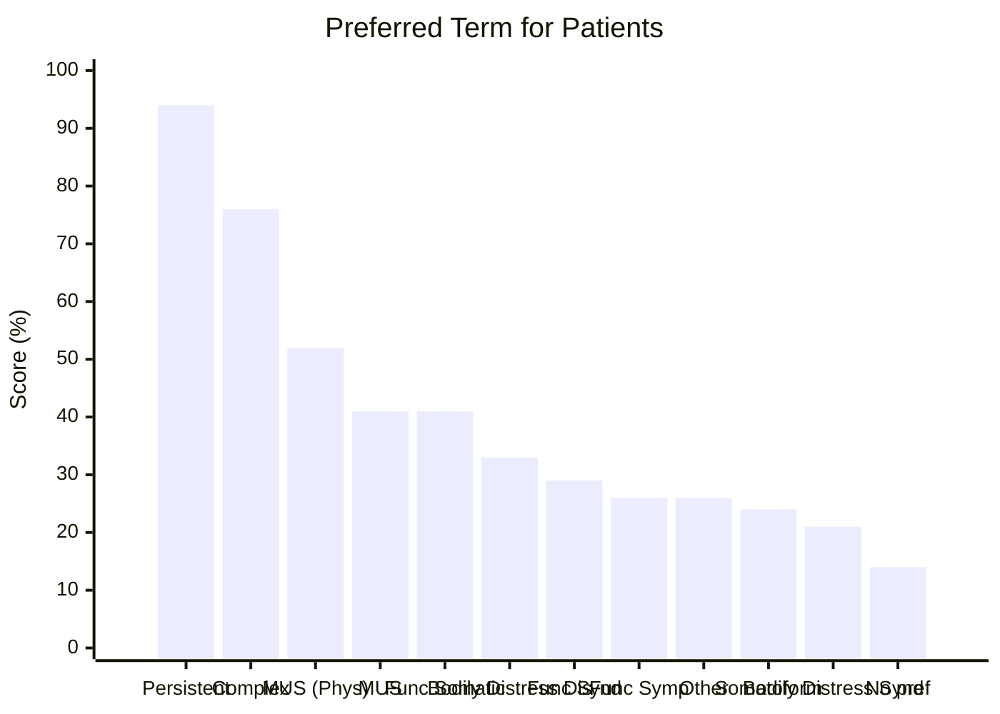

# Supporting Patients with Persistent Physical Symptoms (PPS/MUS)
Agenda
- Background to PPS/MUS terminology 
- Language Considerations 
- Professional Beliefs 
- PWP Assessment Considerations 
- Strengths of a CBT Approach in context of PPS 
- Focus specifically on Chronic Fatigue Syndrome

## MUS Background & Terminology 

Best understood as physical complaints or symptoms that are not explained or understood in terms of underlying organic pathology. It is a wide umbrella term.  
- 1 in 4 people who see a GP have physical symptoms that cannot be explained. 

This is the current accepted scientific term but was previously referred to as:
- Hysteria, Functional, Non-organic or psychosomatic disorder

Terms like dissociative disorder used the DSM or Conversion Disorder in ICD are rooted in psychodynamic model and aetiological roots. 


> [!quote]+ NHS 
> "Persistent Physical Symptoms that don’t appear to be caused by a medical condition. This doesn't mean the symptoms are faked or "all in the head" – they're real and can affect your ability to function properly."
> 
> "Not understanding the cause can make them even more distressing and difficult to cope with.”
> 

## MUS Presentations
As MUS is an umbrella term it encompasses a heterogeneous group of conditions and presentations. 

Common symptoms:
- Pains in muscles or joints
- Back pain
- Headaches
- Tiredness
- Feeling faint
- Chest pain
- Heart palpitations
- Stomach problems 

Less common: 
- Fits
- Breathlessness
- Weakness and paralysis 
- Numbness
- Tingling 

Symptoms can be part of poorly understood syndromes such as:
- Chronic Fatigue Syndrome - CFS or ME
- Irritable Bowel Syndrome - IBS
- Fibromyalgia - Pain all over the body
- Functional Neurological Disorder (FNDs) - symptoms thought to be caused by nervous system rather than a physical condition 

## The Language Debate
There are two approaches (Chalder & Willis, 2017):

**Lumping**
- Given the shared characteristics syndromes can be collapsed into broader categories i.e MUS, MUPS, PPS, FFS

**Splitting**
- Specialists prefer labelling specific syndromes  i.e CFS or IBS etc

The best way is to go by patient preference as most important in practice. (Picariello et al, 2015)

### CFS Patients Language Preferences (Picariello et al, 2015)
Assessed top preference of 87 CFS patients is for an alternative term to MUS.

They found the following:


## Barriers to Mental Health Care in PPS / MUS
- Overlap with LTC barriers. 
- Referral to MHS can feel invalidating - what are they going to do?
- Stigma
- Practitioner Beliefs 
- Previous experiences 

## Professional Beliefs about MUS (Kemp et al., 2013)

Investigated the best language used to describe MUS by practioner 

```mermaid
graph LR

     Root Node
    Root["Question of<br/>Causation"]:::rootBox

    %% Question 1
    Q1["What degree of risk does<br/>childhood sexual abuse<br/>present regarding the<br/>development of MUS:"]:::qBox
    A1["• Neurologists 55.5% High<br/>• Psychiatrists 53% High<br/>• Psychologists 30.3% High"]:::aBox
    
    %% Question 2
    Q2["Blocked out memories of<br/>past trauma results in<br/>Medically Unexplained<br/>Symptoms:"]:::qBox
    A2["• Psychiatrists 58% Agree 42% Somewhat agree<br/>• Neurologists 44% Agree 11.1% Somewhat agree<br/>• Psychologists 31.7% Agree 42.4% Somewhat agree"]:::aBox
    
   
    Root --> Q1
    Q1 --- A1

    Root --> Q2
    Q2 --- A2
```

As there is uncertainty that can lead reduced confidence.
- Often coming in with lots of experience from past practitioners. 

## Supporting Patient with PPS in Talking Therapies Services
General interpersonal skills still apply - empathy and normalisation
Do consider:
- relevant info gathering and giving during the assessment 
- Consider the language we are using 
- Context in which CBT is being introduced - we are not treating the LTC / MUS
	- Not stating it is all in your head. 
- Agreeing the focus or target of treatment 
- Specific CBT treatment pathways/models which can be used to treat CFS, IBS and ‘MUS not otherwise specified’ at Step 3

### General Approach
- [i] Patients with PPS may have experienced invalidation from others. It is essential to convey that you do no believe their symptoms "are all in their mind" or imagined. 

Avoid early discussion around causation and avoid contradicting understanding. 

You can gently introduce the idea that even when the cause is unclear, **physical and psychological factors often interact and can maintain symptoms.** 
- Maybe consider the analogy of medication - if we are in pain we use pain killers to help us keep going and doing things but it may not remove the root cause of pain. 

Reflect and summarise the patients own descriptions and any metaphors they like to use.
- Keep an eye out for self-blame or beliefs about failing to obtain a diagnosis and explore and gently challenge these. 

Areas to explore and consider 
- What the patient currently does to manage or alleviate symptoms— what is helpful or unhelpful? 
- When symptoms reduce—what do they believe helps?
- Patterns or triggers for symptom recurrence— what do they believe makes symptoms worse?
- Any outstanding physical investigations (while acknowledging that lack of findings does not eliminate future medical possibilities).
- Influence of other professionals, carers, or relatives on the patient’s beliefs about PPS.

## CBT Approach and Benefits

We always take a holistic approach for understanding and formulating things. 
- We avoid the mind-body dichotomy or separating physical and mental. 
- We focus on symptom management and ways of coping rather than causation. 


On Days 3 & 4 we will develop skills around exploring 'Illness representations' to inform CBT maintenance cycle and using a Physical Symptoms Diary to explore links between physical and psychological symptoms (useful regardless of whether medically explained or not)


| Condition    | Therapy                                                     |
| ------------ | ----------------------------------------------------------- |
| CFS          | Energy Management, CBT                                      |
| Chronic Pain | Combined physical and psychological treatment including CBT |
| IBS          | CBT                                                         |
| MUS or PPS   | CBT                                                         |

## CFS/ME

Myalgic encephalomyelitis, also called chronic fatigue syndrome or ME/CFS, is a **long-term condition** **that can affect different parts of the body.** The cause is unknown. 

There are 4 main symptoms: 
1. Feeling extremely tired all the time (fatigue), which can make daily activities like taking a shower, or going to work or school, difficult
2. Sleep problems, including insomnia, sleeping too much, feeling like you have not slept properly and feeling exhausted or stiff when you wake up
3. Problems with thinking, concentration and memory (brain fog)
4. Symptoms getting worse after physical or mental activity, and possibly taking weeks to get better (also called post-exertional malaise, or PEM)

Some people with ME/CFS may also have pain in different parts of the body or flu-like symptoms, such as high temperature, headache and aching joints or muscles.

### Causes 
No conclusive cause - but is classified as a post-viral fatigue syndrome and defined as a disorder of the nervous system. 


> [!quote]+ Shepherd, 2020
> “Those who adhere to the physical model of causation believe that ME/CFS is perpetuated by a complex interaction involving changes to the way in which the brain, muscle, immune and endocrine systems respond to the triggering viral infection, or other immune system stressor.”
> 

Long-Covid is another example but further research is needed and required. 

### Post-Exertional Malaise
In some conditions and circumstances reduced actiivty levels and rest is actually helpful and more effective self-management. 

The worsening of symptoms that can follow minimal cognitive, physical, emotional or social activity, or activity that could previously be tolerated.

Symptoms can typically worsen 12 to 48 hours after activity and last for days or even weeks, sometimes leading to a relapse.

N.B:
- That exertion does not mean Exercise 
- Exertion can take many forms and can be delayed by about 24hrs. 

Deconditioning: 
- Where worse physical fitness leads to increased fatigue and reduced activity and further impairment. 

## Looking Ahead
On Day 3 we will cover:
- Transition & Adjustment
- Illness Beliefs/ Representations – how to explore and use to inform support

On Day 4:
- Use of a physical symptoms diary
- Activity management & Pacing Strategy 